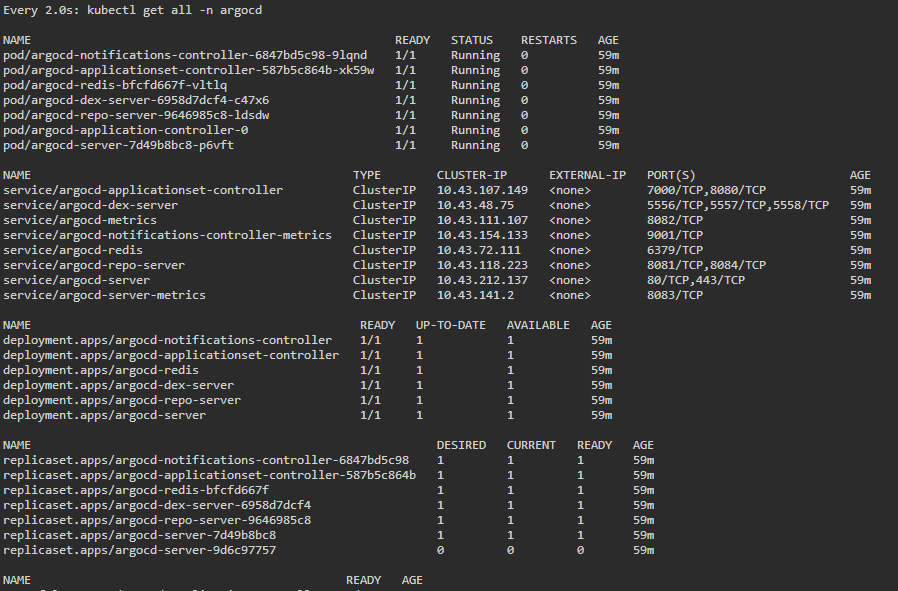
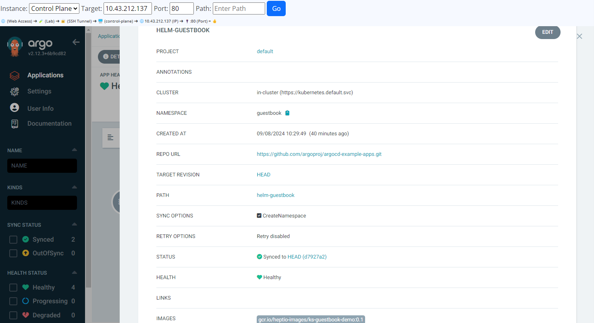
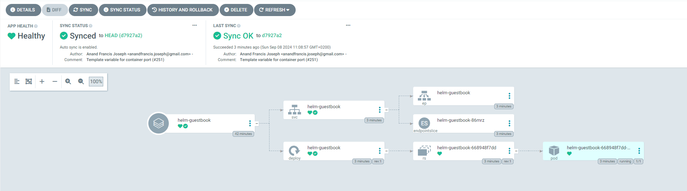
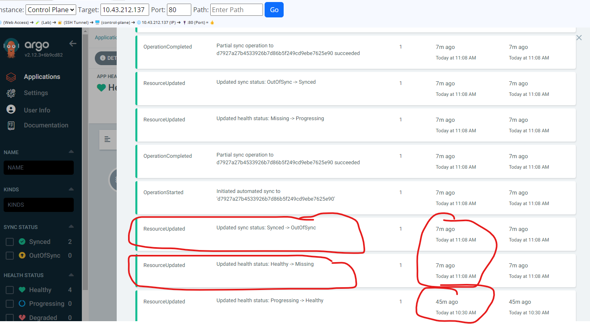

# Buzzwords
- Cloud native application delivery:
  - Rapid, scalable and resilient deployment of applications in cloud environments
  - Uses containersiation, microservices to achieve this
- GitOps:
  - A method of infrastructure management where we use `git` as the single source of truth to manage k8s clusters and application delivery. Read below for what this is useful for.

# GitOps
- We have used `helm` to deliver application (through the use of `helm install` in our experience till now.
- However, `helm` is mainly primarily only used for packaging; `helm install` is meant as supplementary, just for POC simple deployments.
  - `Helm`'s main purpose is it's templating feature, not the install feature.
- Most importantly, `helm` install does not have ability to track any changes/deviations of the deployed application with the git repository the helm chart is committed in.
  - Thus, if you deployed an app in namespace `namespacedeployedbyhelm` using Helm, and then someone accidentally does `kubectl delete namespace -n namespacedeployedbyhelm`, the deployment will not try to re-sync with the Helm code in the git repository, and the app goes down indefinitely!
  - i.e. although the deployed app is robust against application-level errors (through k8s features such as liveness probes etc.), it is not robust against accidental changes in the k8s manifests itself/platform-level changes
- `GitOps` is then the way to achieve this synchronization, with `Argo CD` being one such tool to achieve this
  - First we install `Argo CD` on our cluster, after install we get this
  
  - Then we can get into its UI and deploy a k8s manifest(s), this can also be a Helm chart (example: https://github.com/argoproj/argocd-example-apps/tree/master/helm-guestbook)
  
  We also get a nice UI on our deployment and what is going on
  visually; although we usually would use `k9s` for this
  
  - If we do `kubectl delete namespace guestbook` from CLI, `Argo CD` will detect that there is deviation from what is deployed with what is there in git, and will restore to what git has
    
- This would've been useful for `vfab dashboard` app back then
  - When we want to update our password in `secrets.yaml`, we had to
    - Checkout master of the chart of the app deployment in the worker node
    - Make a new branch
    - Change the password in `secrets.yaml`
    - Do `helm upgrade .....`
    - Push feature branch to remote
    - Make PR and merge to master
  - The above is time consuming and error prone; we may forgot to push feature branch and make PR. Manual things like this can make the Helm chart deployed and what is in master in git go out of sync easily!!! It was ok because it was only I who did anything with k8s; but if there are 10 people working on it, it will go awry.
  - Had we used GitOps instead (e.g. with the Argo CD), we only need to make the PR and merge to master, and the upgrade is done automatically by `Argo CD`! Less error prone!

# Pricing
- A VM in the cloud's pricing can be in 3 categories:
  - On-demand
  - Reserved
  - Spot
- On-demand:
  - Most flexible but most expensive
- Reserved:
  - Less flexible (need to commit at least for a given time period), but is less expensive
- Spot:
  - Can be deleted by the cloud provider at any time, if the VM is sitting idle for too long, but is the cheapest

# KCNA specific things
- logs can be output as text or json
- kubectl logs get both stdout and stderr
- prometheus expose liveness probe on `metrics` endpoint
- `APM server` uses a push model metric collection i.e. the apps send the metrics to the APM server (through `opentelemetry-sdk apm sdk` for Django as example, see powerpoint)
- `Prometheus` uses a pull model metric colelction i.e. the app needs to have a special endpoint open for prometheus to collect data from
  - Prometheus provides client libraries for most programming languages that you can use to instrument in-house apps for Prometheus integration.
  - If you don’t have access to the source code of 3rd-party apps, you won’t be able to directly instrument them via client libraries. In these situations, you can run a Prometheus exporter in a sidecar container that will reformat data for Prometheus.
  - If the app is a cron job (so it will die by the time prometheus tries to collect from it), it can push metrics to a `PushGateway` tool Prometheus offers, and then Prometheus will scrape it periodically
- `namespaced vs virtualized vs sandboxed`;
  - namespaced resources isolated at kernel level ie process ids, network, file systems all are isolated, but they share the host kernel (less secure) e.g. Linux Containers LXC or Docker
     - if container host has kernel vulnerability, the host is vulnerable (kernel escape)
     - use tools like `seccomp, SELinux` to minimise damage
  - virtualized is VMWare, VirtualBox, Hyper V etc
    - expensive resource wise
  - Sandboxed is like running browser plugins or third party libraries ie run only one process pid in a secured environment
- Cluster network policies only manage traffic between pods, but they cant do zecurity like encrypt traffic etc
- Zipkin Jaeger is for tracing
- Traefik is competitor of nginx
- kubectl upgrades support one v up and one v down
-`Pushgateway` is a tool to accept metrics pushed 