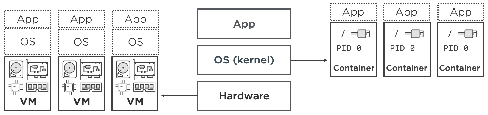

# Docker

## General stuff
- Containers are instances of an image
-  Get all running containers and images inside it: ```sudo docker ps -a```
- Get into failed docker build: ```sudo docker run -i -t (last successfully built image inside the container where the build failed) sh```
- Delete all containers: ```docker container prune```
- Delete one container: ```docker rm CONTAINER```
- Delete all images and containers: ```docker system prune --all"```
- Delete one image: ```docker rmi IMAGE```
- MYSQL image draai niet; exit met 137 error. Oplossing: zie https://unix.stackexchange.com/questions/128642/debug-out-of-memory-with-var-log-messages. In kortom: Linux kan mischieen je container afmaken zonder je het te weten want je heeft geen genoeg RAM :(
- Kan geen verbinding maken met een MYSQL container met een shared volume, hoewel je de environment variabelen hebben toegepast in Docker Compose, en toegang van buiten hebben toelaten. Oplossing: https://github.com/docker-library/mysql/issues/275#issuecomment-292243855. In kortom: In de eerste poging van `docker-compose up`, zorg ervoor dat de volume die in `volume` rij van je `docker-compose.yml` NIET BESTAAT!!! Anders, wordt de environment variabelen niet toegepast!
- Make non-root user (who is sudoer) able to run docker without sudo: `sudo usermod -aG docker $USER`
- Shell vs. Exec form of CMD and Entrypoint; it matters: https://emmer.dev/blog/docker-shell-vs.-exec-form/#signal-trapping-forwarding (use internet archive if the link is gone)

## Theory

- What is the difference between VM and Containers?
  - VM virtualises hardware (`hypervisor virtualization`). 
    - This means it takes physical servers and slices them into virtual servers that we call virtual machines (VM). 
    - For example, CPUs are sliced into virtual CPUs, storage is sliced into virtual storage, and network cards are sliced into virtual network cards. These virtual resources are combined into VMs that look, smell, and feel like regular physical servers. 
    - You then install a single OS and application in each VM. 
  - Container virtualizes operating systems
    - It takes operating systems like Linux and Windows and slices them into virtual operating systems called containers. 
    - For example, process trees are sliced into virtual process trees, filesystems are sliced into virtual filesystems, and network interfaces are sliced into virtual interfaces. 
    - These virtual resources are combined into containers that look, smell, and feel like regular operating systems. 
    - You then run a single application in each container. 
  - Diagram:
  
  - As seen above, if you slice up VMs, you run a new OS on each. If you slice up the OS, you run each app inside each OS slice.
  - Containers are more lighter weight than hypervisor virtualization (i.e. VMs)
- Every node that wants to run containers need a `container runtime`
  - A runtime can be either `high level` or `low level`
  - A `low level` container directly runs containers
    - Example: `runc`, `cri-o`, `kata-runtime`
  - A `high level` container manages containers and its images
    - Example: `containerd`, `rkt`, `Docker`, `Podman`, `Kata`, `gVisor`
    - They talk to the `runc` low level `container runtime` to run the containers
    - Some are limited in capability (e.g. `containerd` cannot build images), while others are more powerful but more bloated (e.g. `Docker` can build images)
    - However, some depend on each other to work (e.g. `Docker` needs specifically `containerd` to talk to `runc`; it cannot talk to `runc` directly)
  - There is a standard called `OCI` (Open Container Initiative) that defines standards on `images` and `runtimes`
    - OCI compliant images are images that are guaranteed to be able to be run by OCI compliant runtimes
    - Tools that can build `OCI compliant images` include `Docker` or `Buildah`
    - Container runtimes such as `runc` and `kata` are guaranteed to be able to run these images; thus they are an `OCI compliant runtime`.
    - Thus, `OCI compliant runtime` term is only really applicable to `low-level` container runtimes
  Put image here
- To orchestrate containers, we can use Kubernetes
  - Look at k8s notes first to understand this section
  - To orchestrate containers, the `kubelet` needs to communicate with a high level container runtime, and, this high level container runtime has to implement the `CRI` (`Container Runtime Interface`)
  - So, in the ideal world, we need a chain of high and low level container runtimes, where the chain:
    - Speaks `CRI` at its input side so kubelet can talk to it
    - OCI compliant so it can run standard images
    - Most high-level container runtimes need a translator (i.e. `shim`) to translate the `CRI` so that kubelet can talk to it
    - Below image explains many possible alternatives

- Docker uses `Linux namespaces` and `cgroups` to isolate pids, which is not so secure.
  - More secure alternwtives are `gVisor` or `Kata`
  - `gVisor` creates a user space kernel called `Sentry`, which intercepts and handl2s host system calls (e.g. `open(/etc/passwd), connect(sockfd)`) made by the container and perform them in a more secure environment.
  - `Kata` creates a lightweight VM to run the container, even more secure

- `namespaces` and `cgroups` example
Example of cgroups and namespaces (General)

Scenario: Isolating Processes on a Linux System

Let’s consider a general example where we use cgroups and namespaces to isolate two different applications running on the same Linux host.

1. Using cgroups

Goal: Limit resource usage for a process group.

Example:

1. Create a cgroup:

sudo cgcreate -g memory,cpu:/mygroup


2. Set resource limits:

sudo cgset -r memory.limit_in_bytes=500M mygroup
sudo cgset -r cpu.shares=512 mygroup


3. Run a process within the cgroup:

sudo cgexec -g memory,cpu:mygroup ./my_application


Explanation:

This creates a cgroup named mygroup that limits memory usage to 500 MB and CPU shares to 512 (relative weight). Running my_application within this cgroup enforces these limits.


2. Using namespaces

Goal: Isolate the network and process IDs for two different applications.

Example:

1. Create a new network namespace:

sudo ip netns add mynamespace


2. Run a process in the new namespace:

sudo ip netns exec mynamespace ./my_networked_application


3. Verify the network namespace:

ip netns list


Explanation:

This creates a new network namespace called mynamespace. Running my_networked_application in this namespace allows it to have its own network stack, separate from other applications on the host.


Key Concepts Illustrated:

cgroups: Control resource limits to prevent a single application from consuming too many resources on the host.

Namespaces: Isolate application environments to ensure they operate independently, with separate views of system resources.


Conclusion

In this general example, we demonstrated how to use cgroups to limit resource usage and how to create and use namespaces for process isolation on a Linux system. These mechanisms are essential for managing multiple applications securely and efficiently on a single host.

- example with containers:
Example: Using cgroups and namespaces in a Container Environment

Scenario: Running a Web Application in a Container

Goal: Isolate resources and provide controlled access for a web application running in a Docker container.

1. Using cgroups

Setting Resource Limits:

Scenario: You want to limit the memory and CPU usage of your web application to ensure it doesn't consume too many resources on the host.


Command:

docker run --memory=256m --cpus=1 my-web-app

Explanation:

This command runs the container for my-web-app with a memory limit of 256 MB and 1 CPU core. If the application tries to exceed these limits, it will be throttled or killed, ensuring that it does not impact other applications running on the host.


2. Using Namespaces

Isolating Network and Process IDs:

Scenario: You want your web application to have its own network stack and process IDs, ensuring that it does not interfere with other applications.


Command:

docker run --name web-app --net my-network --rm my-web-app

Explanation:

The --net my-network option creates a custom network namespace for the container. This means that the container has its own network interfaces and IP addresses, isolated from the host and other containers.

The --rm flag ensures that the container is removed after it stops, cleaning up resources automatically.


3. Running a User Kernel (e.g., gVisor)

Adding an Extra Layer of Security:

Scenario: You want to run the same web application but with enhanced security against potential vulnerabilities.


Command (using gVisor):

docker run --runtime=runsc --name secure-web-app --memory=256m --cpus=1 my-web-app

Explanation:

This command uses runsc (the gVisor runtime) instead of the default Docker runtime. By running the application inside gVisor, all system calls from the container are intercepted and handled by the gVisor user-space kernel, which provides additional isolation from the host kernel.


Summary of the Example

Cgroups are used to manage and limit the resources (CPU and memory) allocated to the web application.

Namespaces isolate the container's network and process IDs, preventing interference with other applications on the host.

A user kernel (gVisor) adds an extra layer of security by handling system calls in user space, minimizing the risk of vulnerabilities that could affect the host.


This example demonstrates how cgroups and namespaces work together in a containerized environment and how using a user kernel can enhance security for applications running in containers.


