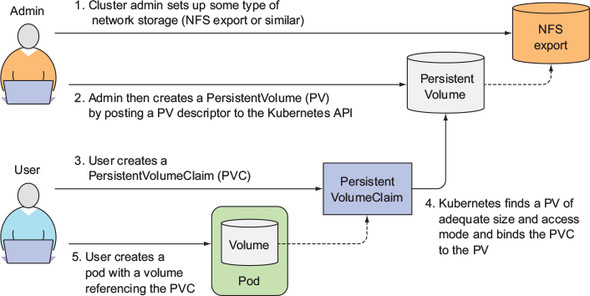
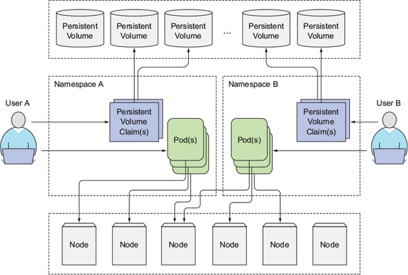
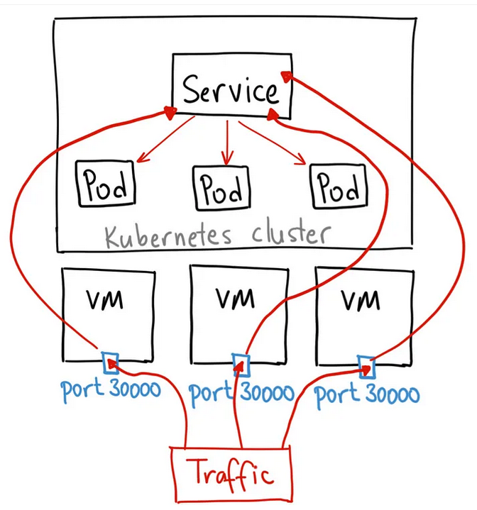
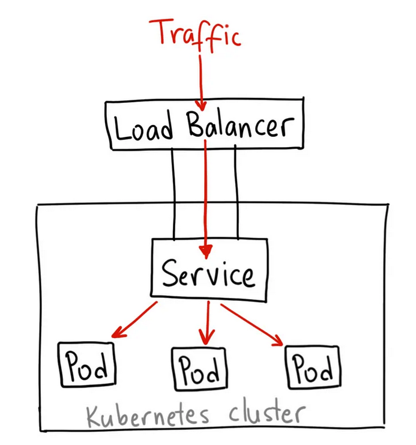
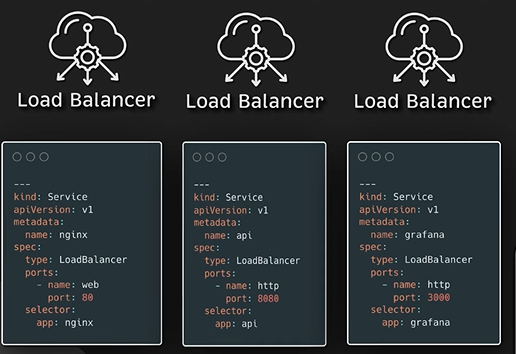
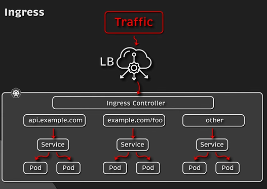
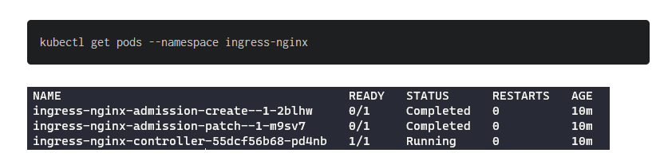
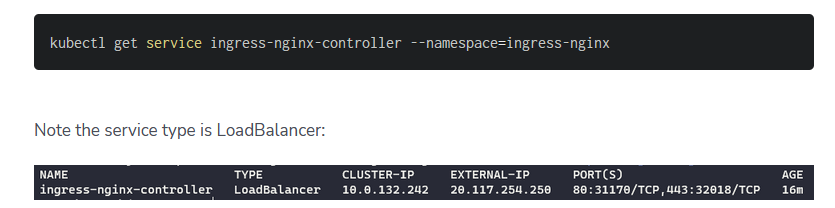
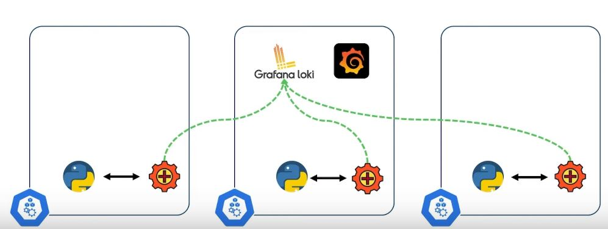

course: https://app.pluralsight.com/library/courses/kubernetes-installation-configuration-fundamentals/table-of-contents
---------------------------------
# Debugging issues
### From experience
- How to get into a `crashloopbackoff` container: in the container yaml, set this: `command: ["sh", "-c", "while true; do echo hello; sleep 86400; done"]` to override the image's entrypoint, and thus you can investigate the container's contents (e.g. whoami, ls -la, pwd, etc.) easily!!!, and also run the supposed command one by one.
- How to copy file or folder from pod container to host: `kubectl cp -c yourbackendcontainernameinthepod <your-namespace>/<your-backend-pod-name-get-it-from-kubectl-get-pods>:mydesireddatabase.sqlite mydesireddatabase.sqlite`; you may get warning but ignore it, file/folder is copied
- If you wanna talk, from outside your cluster (e.g. VDI terminal when you were at AMLS) to a pod whose port is exposed to a service with name aldo-elasticsearch in your namespace: `kubectl port-forward --namespace aldo-elasticsearch svc/aldo-elasticsearch 9200:9200`
------------------------------------------------------------
### Throwaway pod
If you need a pod that runs forever, copy paste below and kubectl apply it:
```
apiVersion: v1
kind: Secret
metadata:
  name: mysecret
data:
  .dockerconfigjson: someJWTtokentopullyourimagefromyourprivatereg
type: kubernetes.io/dockerconfigjson

---
apiVersion: apps/v1
kind: Deployment
metadata:
  name: test
spec:
  selector:
    matchLabels:
      app: mypod
  replicas: 1
  template:
    metadata:
      labels:
        app: mypod
    spec:
      imagePullSecrets:
      - name: mysecret  # only relevant really if you pull from private regs
      containers:
        - name: kubectlexecintome
          image: busybox  # or some other image you wanna get into in k8s
          imagePullPolicy: Always
          command:                                                                                                                                 
            - "/bin/sh"                                                                                                                               
            - "-c"                                                                                                                                     
            - "tail -f /dev/null"
```
------------------------------------------------------------
# Introduction to theories
Get all objects currently registered: kubectl get all

Context related
- kubectl config use-context
-	kubectl config get-contexts
-	kubectl config current-context
-	kubectl config set-context
-	kubectl config delete-context
-	kubectl config view
-	kubectl config use-context <context-name> --namespace=<namespace>
 
Namespace related
-	kubectl get namespaces
-	kubectl create namespace
-	kubectl delete namespace
-	kubectl describe namespace
-	kubectl apply -f <filename.yaml> (to create a namespace from a YAML file)
-	kubectl edit namespace <namespace-name> (to edit a namespace)
-	kubectl config set-context --current --namespace=<namespace-name> (to set the namespace for the current context)
-	kubectl get pods --namespace=<namespace-name> (to list all the pods in a specific namespace)
 
deployment related
-	kubectl get deployments (to list all deployments)
-	kubectl create deployment (to create a new deployment)
-	kubectl delete deployment (to delete a deployment)
-	kubectl describe deployment (to get detailed information about a deployment)
-	kubectl apply -f <filename.yaml> (to create or update a deployment from a YAML file)
-	kubectl rollout status deployment/<deployment-name> (to check the rollout status of a deployment)
-	kubectl rollout history deployment/<deployment-name> (to view the rollout history of a deployment)
-	kubectl rollout undo deployment/<deployment-name> (to undo the most recent rollout of a deployment)
-	kubectl scale deployment/<deployment-name> --replicas=<number-of-replicas> (to scale a deployment)
 
pods related
-	kubectl get pods (to list all pods)
-	kubectl describe pod (to get detailed information about a pod)
-	kubectl logs (to view the logs of a pod)
-	kubectl exec (to execute a command in a running container of a pod)
-	kubectl delete pod (to delete a pod)
-	kubectl apply -f <filename.yaml> (to create or update a pod from a YAML file)
-	kubectl port-forward (to forward a port from a pod to the local machine)
-	kubectl label pod (to add or remove labels from a pod)
 
The hierarchy in Kubernetes is as follows:
-	A cluster is a collection of nodes that run containerized applications.
-	Each cluster can contain one or more namespaces, which provide a way to group and isolate resources within a cluster.
-	Each namespace can contain multiple Kubernetes objects, such as pods, deployments, services, config maps, and secrets.
-	A pod is the smallest deployable unit in Kubernetes and represents a single instance of a running process in a cluster. A pod can contain one or more containers that share the same network and storage resources. Each container in a pod runs in its own isolated environment, similar to a lightweight virtual machine.
- A pod is usually contained within another Kubernetes object e.g. deployments, services, etc. To permanently delete a pod belonging to another Kubernetes object, you need to delete that object instead
 
- An ingress controller is a service that will create its own separate namespace from the other pods. 
You use it to load balance pods running in other namespaces (e.g. pods in default namespace for example).
 
 -------------
 
 What does single-node cluster mean? It means that the cluster contains only one node (i.e. one VM), aka the master node, and no worker nodes.
 Usually we have worker nodes (i.e. other VMs) that do the work that the master node orchestrates. The worker nodes will create pod(s) inside themselves to do the work.
 With a single node configuration, this means the master node will create the pods inside itself that do the work that it orchestrates. The master node itself also creates a pod that does the orchestration. This all means that nodes do not "do" the work; rather they spin up pods (i.e. containers) that would do the work(s) assigned to them.
 
 --------------

 How to set up your own cluster from scratch? https://1drv.ms/f/s!ApGS4APr_VQLpu8-A4kTgICxMlzEng?e=Bou0Dj

 --------------

 Book used for notes below: Kubernetes in Action
 
 Course: https://udemy.com/course/dive-into-cloud-native-containers-kubernetes-and-the-kcna/learn/lecture/42070196#overview

 ---------------

 # Why we need deployment/replicationcontroller/statefulset/etc to manage pods?

 When you create unmanaged pods, a cluster node is selected to run the pod and then its containers are run on that node. Kubernetes then monitors those containers and automatically restarts them if they fail. But if the whole node fails, the pods on the node are lost and will not be replaced with new ones, unless those pods are managed by a Deployment, ReplicationControllers or similar.

 Kubernetes keeps your containers running by restarting them if they crash or if their liveness probes fail. This job is performed by the Kubelet on the node hosting the pod—the Kubernetes Control Plane components running on the master(s) have no part in this process.

 But if the node itself crashes, it’s the Control Plane that must create replacements for all the pods that went down with the node. It doesn’t do that for pods that you create directly. Those pods aren’t managed by anything except by the Kubelet, but because the Kubelet runs on the node itself, it can’t do anything if the node fails.

----------------------
# Relationship between Deployment, ReplicaSet and Pods

A deployment like this
```
apiVersion: apps/v1
kind: Deployment
metadata:
  creationTimestamp: null
  labels:
    app: nginx
  name: nginx
spec:
  replicas: 12
  selector:
    matchLabels:
      app: nginx
  strategy: {}
  template:
    metadata:
      creationTimestamp: null
      labels:
        app: nginx
    spec:
      containers:
      - image: nginx
        name: nginx
        resources: {}
status: {}
```

Will create automatically these:

```
root@control-plane:~# kubectl get deployment
NAME    READY   UP-TO-DATE   AVAILABLE   AGE
nginx   1/1     1            1           7s
root@control-plane:~# kubectl get replicaset
NAME               DESIRED   CURRENT   READY   AGE
nginx-7854ff8877   1         1         1       8s
kubectl get pods -o wide
NAME                     READY   STATUS    RESTARTS   AGE   IP          NODE            NOMINATED NODE   READINESS GATES
nginx-7854ff8877-4vd75   1/1     Running   0          72s   10.42.0.3   control-plane   <none>           <none>
kubectl get pods -o wide
NAME                     READY   STATUS    RESTARTS   AGE   IP          NODE            NOMINATED NODE   READINESS GATES
root@control-plane:~# kubectl rollout history deployment/nginx
deployment.apps/nginx 
REVISION  CHANGE-CAUSE
1         <none>
```

So, notice how the ReplicaSet name is constructed of the 
- Deployment name and a unique ID

and the Pod name is constructed of the
- Replica set name and a unique ID.

When you do scale the deployment, no new ReplicaSet is created (the existing is updated):

```
root@control-plane:~# kubectl scale deployment/nginx --replicas=10; watch kubectl get pods -o wide
deployment.apps/nginx scaled
root@control-plane:~# kubectl get replicaset
NAME               DESIRED   CURRENT   READY   AGE
nginx-7854ff8877   10        10        10      6m46s
```

But if you change the image tag, a new ReplicaSet is created (e.g. change `nginx` to `nginx:latest` in deployment.yaml above)

```
root@control-plane:~# kubectl get replicaset
NAME               DESIRED   CURRENT   READY   AGE
nginx-7854ff8877   0         0         0       8m22s
nginx-b9b667b8b    12        12        12      16s
```

If we change image tag to an image that doesn't exist (`nginx:bbb` for example), we will get a bad replicaset
```
root@control-plane:~# kubectl get replicaset
NAME               DESIRED   CURRENT   READY   AGE
nginx-7854ff8877   0         0         0       11m
nginx-b9b667b8b    9         9         9       3m17s
nginx-6cc4df8d47   6         6         0       8s
```
Notice the previous ReplicaSet is still `current=9`, and the `desired` is maintained also at 9, since the new one never come up!

So we will rollback the deployment. Rolling back a deployment removes the current replica set and creates a new replicaset:
```
root@control-plane:~# kubectl rollout undo deployment/nginx && kubectl rollout status deployment/nginx
deployment.apps/nginx rolled back
root@control-plane:~# kubectl get replicaset
NAME               DESIRED   CURRENT   READY   AGE
nginx-6cc4df8d47   0         0         0       2m3s
nginx-b9b667b8b    0         0         0       5m12s
nginx-7854ff8877   9         9         9      13m
```

And note, that the deployment history will change from
```
deployment.apps/nginx 
REVISION  CHANGE-CAUSE
1         <none>
2         <none>
3         <none>
```

to

```
REVISION  CHANGE-CAUSE
1         <none>
3         <none>
4         <none>
```

i.e. the revision 2 is removed!

Thus, rolling back to a previous version removes that previous version from history!

So, if we rollback to a specific revision e.g. 1, then we will get history

```
REVISION  CHANGE-CAUSE
3         <none>
4         <none>
5         <none>
```

# Selector and labels

A `label` is used to identify and organize resources.

A `selector` is used to select resources that has a given label.

Example: If we have a `pod` template

```
apiVersion: v1
kind: Pod
metadata:
  creationTimestamp: null
  labels:
    run: nginx
  name: nginx
spec:
  containers:
  - image: nginx
    name: nginx
    ports:
    - containerPort: 80
    resources: {}
  dnsPolicy: ClusterFirst
  restartPolicy: Always
status: {}`
```
It will have a label `run: nginx`. For a service to select this pod, make a service that has this value in selector section of it:

```
root@control-plane:~# kubectl expose pod/nginx --dry-run=client -o yaml
apiVersion: v1
kind: Service
metadata:
  creationTimestamp: null
  labels:
    run: nginx
  name: nginx
spec:
  ports:
  - port: 80
    protocol: TCP
    targetPort: 80
  selector:
    run: nginx
status:
  loadBalancer: {}
```

Note that in creating the above we use `kubectl expose` command, which makes a service object having a label with value equal to the object it is exposing; but the important part for this is the `selector: run: nginx` part

Another example: A YAML like this:
  ```
  apiVersion: v1
kind: ReplicationController        ❶
metadata:
  name: kubia                      ❷
spec:
  replicas: 3                      ❸
  selector:                        ❹
    app: kubia                     ❹
  template:                        ❺
    metadata:                      ❺
      labels:                      ❺
        app: kubia                 ❺
    spec:                          ❺
      containers:                  ❺
      - name: kubia                ❺
        image: luksa/kubia         ❺
        ports:                     ❺
        - containerPort: 8080
  ```

  Means that the ReplicationController set will track pods with label `app=kubia`, and additionally create pods with `app=kubia` such that there are 3 pods of such label in the cluster. If you manually rename the label of one of the pods, it will not be tracked by this object anymore.

  Changing a ReplicationController’s pod template `labels` only affects pods created afterward and has no effect on existing pods.
 
 ---------------
 ### Liveliness

 Kubernetes can probe a container using one of the three mechanisms:

 - An HTTP GET probe performs an HTTP GET request on the container’s IP address, a port and path you specify. If the probe receives a response, and the response code doesn’t represent an error (in other words, if the HTTP response code is 2xx or 3xx), the probe is considered successful. If the server returns an error response code or if it doesn’t respond at all, the probe is considered a failure and the container will be restarted as a result.

 - A TCP Socket probe tries to open a TCP connection to the specified port of the container. If the connection is established successfully, the probe is successful. Otherwise, the container is restarted.

 - An Exec probe executes an arbitrary command inside the container and checks the command’s exit status code. If the status code is 0, the probe is successful. All other codes are considered failures.

 Restart reason can be described: `kubectl describe po kubia-liveness`

  The exit code e.g. 137 is a sum of two numbers: 128+x, where x is the signal number sent to the process that caused it to terminate. In the example, x equals 9, which is the number of the SIGKILL signal, meaning the process was killed forcibly.

When a container is killed, a completely new container is created—it’s not the same container being restarted again.

Always remember to set an initial delay to account for your app’s startup time

For a better liveness check, you’d configure the probe to perform requests on a specific URL path (/health, for example) and have the app perform an internal status check of all the vital components running inside the app to ensure none of them has died or is unresponsive.

Be sure to check only the internals of the app and nothing influenced by an external factor. For example, a frontend web server’s liveness probe shouldn’t return a failure when the server can’t connect to the backend database. If the underlying cause is in the database itself, restarting the web server container will not fix the problem. Because the liveness probe will fail again, you’ll end up with the container restarting repeatedly until the database becomes accessible again.

# Job and CronJob objects

 It is like deployment, but it creates pods that carry out batch tasks i.e. a pod that has an ending state (since usually pods are always alive e.g. a webserver). So, in vfi, the new orchestrator should create a Job object, which is then the analog of our Jenkins master creating worker pod. 

 Example to create a job that calculates pi:
 
 `kubectl create job calculatepi --image=perl:5.34.0 -- "perl" "-Mbignum=bpi" "-wle" "print bpi(2000)"`
 
 When we watch the job `watch kubectl get jobs`, when complete we will get output like

 ```
 NAME          COMPLETIONS   DURATION   AGE
calculatepi   1/1           32s        2m6s
 ```

 Note that the pod will have the job name appended to the front 
 ```
kubectl get pods
NAME                READY   STATUS      RESTARTS   AGE
calculatepi-v2wc4   0/1     Completed   0          27m
 ```

 Thus the stdout of the job can be gotten with the trick like

 ```
kubectl logs $(kubectl get pods | grep calculatepi | awk {'print $1'})

3.1415926535897932384626433832795028841971693993751058209749445923078164062862089986280348253421170679821480865132823066470938446095505822317253594081284811174502841027019385211055596446229489549303819644288109756659334461284756482337867831652712019091456485669234603486104543266482133936072602491412737245870066063155881748815209209628292540917153643678925903600113305305488204665213841469519415116094330572703657595919530921861173819326117931051185480744623799627495673518857527248912279381830119491298336733624406566430860213949463952247371907021798609437027705392171762931767523846748184676694051320005681271452635608277857713427577896091736371787214684409012249534301465495853710507922796892589235420199561121290219608640344181598136297747713099605187072113499999983729780499510597317328160963185950244594553469083026425223082533446850352619311881710100031378387528865875332083814206171776691473035982534904287554687311595628638823537875937519577818577805321712268066130019278766111959092164201989380952572010654858632788659361533818279682303019520353018529689957736225994138912497217752834791315155748572424541506959508295331168617278558890750983817546374649393192550604009277016711390098488240128583616035637076601047101819429555961989467678374494482553797747268471040475346462080466842590694912933136770289891521047521620569660240580381501935112533824300355876402474964732639141992726042699227967823547816360093417216412199245863150302861829745557067498385054945885869269956909272107975093029553211653449872027559602364806654991198818347977535663698074265425278625518184175746728909777727938000816470600161452491921732172147723501414419735685481613611573525521334757418494684385233239073941433345477624168625189835694855620992192221842725502542568876717904946016534668049886272327917860857843838279679766814541009538837863609506800642251252051173929848960841284886269456042419652850222106611863067442786220391949450471237137869609563643719172874677646575739624138908658326459958133904780275901
 ```
 
 More info on jobs and its possibilities `kubectl explain job.spec | more`

 Important to note here is the option completions and parallelism
 ```
 completions   <integer>
    Specifies the desired number of successfully finished pods the job should be
    run with.  Setting to null means that the success of any pod signals the
    success of all pods, and allows parallelism to have any positive value.
    Setting to 1 means that parallelism is limited to 1 and the success of that
    pod signals the success of the job. More info:
    https://kubernetes.io/docs/concepts/workloads/controllers/jobs-run-to-completion/

parallelism   <integer>
    Specifies the maximum desired number of pods the job should run at any given
    time. The actual number of pods running in steady state will be less than
    this number when ((.spec.completions - .status.successful) <
    .spec.parallelism), i.e. when the work left to do is less than max
    parallelism. More info:
    https://kubernetes.io/docs/concepts/workloads/controllers/jobs-run-to-completion/
  ```

  With this options, a deployment manifest like
  ```
apiVersion: batch/v1
kind: Job
metadata:
  creationTimestamp: null
  name: calculatepi
spec:
  completions: 20
  parallelism: 5
  template:
    metadata:
      creationTimestamp: null
    spec:
      containers:
      - command:
        - perl
        - -Mbignum=bpi
        - -wle
        - print bpi(2000)
        image: perl:5.34.0
        name: calculatepi
        resources: {}
      restartPolicy: Never
  ```

 This will generate, by the end of job execution, 20 pods that will do the command, and at any given time, only 5 pods can exist.

 Notice above that when we did `kubectl get jobs` we get cluttered with history of completed jobs. We can delete a job like `kubectl delete job/calculatepi`. But what if we want to keep only a certain number of completed jobs to retain? See CronJob below!
 
 ## CronJob
 CronJob resources will Job resource at approximately the scheduled time. The Job then creates the worker pods. The syntax is very similar.
 
 ```
apiVersion: batch/v1
kind: CronJob
metadata:
  creationTimestamp: null
  name: calculatepi
spec:
  completions: 20
  parallelism: 5
  template:
    metadata:
      creationTimestamp: null
    spec:
      containers:
      - command:
        - perl
        - -Mbignum=bpi
        - -wle
        - print bpi(2000)
        image: perl:5.34.0
        name: calculatepi
        resources: {}
      restartPolicy: Never
  successfulJobsHistoryLimit: 3
 ```

 The above will:
 - Create a job every minute, where each job will eventually create 20 pods by the end, with only 5 pods can run at the same time.
 - Each pod will calculate pi
 - It will keep only 3 successful job history; this is handy to keep the history of job executions clean!
 - The history may surge to 4 for a little bit, but it will go back to 3 eventually

 It may happen that the Job or pod is created and run relatively late. You may have a hard requirement for the job to not be started too far over the scheduled time. In that case, you can specify a deadline by specifying the startingDeadlineSeconds field in the CronJob specification.

 In normal circumstances, a CronJob always creates only a single Job for each execution configured in the schedule, but it may happen that two Jobs are created at the same time, or none at all. To combat the first problem, your jobs should be idempotent (running them multiple times instead of once shouldn’t lead to unwanted results). For the second problem, make sure that the next job run performs any work that should have been done by the previous (missed) run.

 Thus, CronJob are for tasks that:
 - Don't have a problem being run multiple times; since a delay  of the first execution could make the second execution execute during the first execution! So, your command needs to have good error handling (e.g. if it writes something to db, perhaps do like `get_or_create` of Django)
 - A job may even not execute at all (missed) due to some reason! Thus, the command must be such that it is 'complete' i.e. does not rely on any previous execution e.g. not relying on the time of the previous execution to do some command, since the previous execution may never even happen!

 ------------------

 ### Volumes

 Here’s a list of several of the available volume types:

- emptyDir—A simple empty directory used for storing transient data, and sharing data between containers in the pod. These are stored in `/var/lib/kubelet/pods/<pod_uid>/volumes/kubernetes.io-empty-dir/<volume_name>`

example: 
```
apiVersion: v1
kind: Pod
metadata:
  name: fortune
spec:
  containers:
  - image: luksa/fortune                   ❶
    name: html-generator                   ❶
    volumeMounts:                          ❷
    - name: html                           ❷
      mountPath: /var/htdocs               ❷
  - image: nginx:alpine                    ❸
    name: web-server                       ❸
    volumeMounts:                          ❹
    - name: html                           ❹
      mountPath: /usr/share/nginx/html     ❹
      readOnly: true                       ❹
    ports:
    - containerPort: 80
      protocol: TCP
  volumes:                                 ❺
  - name: html                             ❺
    emptyDir: {}
```
will create `/var/lib/kubelet/pods/<pod_uid>/volumes/kubernetes.io-empty-dir/html` folder in the node, and the contents of this folder will be available in `/var/htdocs` of `html-generator` and `/usr/share/nginx/html` of `web-server`. Note that if the containers contain data in their respective folders, those will be wiped out (Remember API Libs issue with AT that we solved!)

- hostPath—Used for mounting directories from the worker node’s filesystem into the pod.

- gitRepo—A volume initialized by checking out the contents of a Git repository.

- nfs—An NFS share mounted into the pod.

- gcePersistentDisk (Google Compute Engine Persistent Disk), awsElasticBlockStore (Amazon Web Services Elastic Block Store Volume), azureDisk (Microsoft Azure Disk Volume)—Used for mounting cloud provider-specific storage.

- cinder, cephfs, iscsi, flocker, glusterfs, quobyte, rbd, flexVolume, vsphere-Volume, photonPersistentDisk, scaleIO—Used for mounting other types of network storage.

- configMap, secret, downwardAPI—Special types of volumes used to expose certain Kubernetes resources and cluster information to the pod.

- persistentVolumeClaim—A way to use a pre- or dynamically provisioned persistent storage.

 To enable apps to request storage in a Kubernetes cluster without having to deal with infrastructure specifics, two new resources were introduced. They are Persistent-Volumes and PersistentVolumeClaims. The names may be a bit misleading, because even regular Kubernetes volumes can be used to store persistent data. The process is as shown:
 

 So the admin creates a persistent disk first (point 1. in above picture):
 ```
 $ gcloud container clusters list
NAME   ZONE            MASTER_VERSION  MASTER_IP       ...
kubia  europe-west1-b  1.2.5           104.155.84.137  ...

$ gcloud compute disks create --size=1GiB --zone=europe-west1-b mongodb
WARNING: You have selected a disk size of under [200GB]. This may result in
     poor I/O performance. For more information, see:
     https://developers.google.com/compute/docs/disks#pdperformance.
Created [https://www.googleapis.com/compute/v1/projects/rapid-pivot-
     136513/zones/europe-west1-b/disks/mongodb].
NAME     ZONE            SIZE_GB  TYPE         STATUS
mongodb  europe-west1-b  1        pd-standard  READY
 ```
 And then we make a `PersistentVolume` that refers to this disk:
 ```
 apiVersion: v1
kind: PersistentVolume
metadata:
  name: mongodb-pv
spec:
  capacity:                                 ❶
    storage: 1Gi                            ❶
  accessModes:                              ❷
  - ReadWriteOnce                           ❷
  - ReadOnlyMany                            ❷
  persistentVolumeReclaimPolicy: Retain     ❸
  gcePersistentDisk:                        ❹
    pdName: mongodb                         ❹
    fsType: ext4 
 ```

 And we can claim this volume using `PersistentVolumeClaim`

 ```
 apiVersion: v1
kind: PersistentVolumeClaim
metadata:
  name: mongodb-pvc              ❶
spec:
  resources:
    requests:                    ❷
      storage: 1Gi               ❷
  accessModes:                   ❸
  - ReadWriteOnce                ❸
  storageClassName: ""           ❹
 ```

 In the above we are not specifically saying we are looking for `PersistentVolume` with name `mongodb-pv`; we are just asking for a random persistent volume that can cater our request. 
 and use it in our Pod e.g.
 ```
 apiVersion: v1
kind: Pod
metadata:
  name: mongodb
spec:
  containers:
  - image: mongo
    name: mongodb
    volumeMounts:
    - name: mongodb-data
      mountPath: /data/db
    ports:
    - containerPort: 27017
      protocol: TCP
  volumes:
  - name: mongodb-data
    persistentVolumeClaim:          ❶
      claimName: mongodb-pvc        ❶
 ```
 PersistentVolumes, like cluster Nodes, don’t belong to any namespace, unlike pods and PersistentVolumeClaims.
 
 

 Instead of creating `PersistentVolume` objects, alternatively, we can deploy a PersistentVolume provisioner and define one or more StorageClass objects to let users choose what type of PersistentVolume they want. The users can refer to the StorageClass in their PersistentVolumeClaims and the provisioner will take that into account when provisioning the persistent storage.

 Assuming a provisioner is available (not gonna go through how to set it up here), we can create a StorageClass object:

 ```
 apiVersion: storage.k8s.io/v1
kind: StorageClass
metadata:
  name: fast
provisioner: kubernetes.io/gce-pd #usually provisioned by azure or AWS
parameters:
  type: pd-ssd                           ❷
  zone: europe-west1-b                   ❷
 ```

and our `PersistentVolumeClaim` then becomes:
```
apiVersion: v1
kind: PersistentVolumeClaim
metadata:
  name: mongodb-pvc
spec:
  resources:
    requests:
      storage: 100Mi
  accessModes:
    - ReadWriteOnce
  storageClassName: fast             ❶
```

In a diagram:

Thus we see that the difference is that the PersistentVolume is created dynamically by the provisioner, rather than the Admin having to create each PersistentVolume and having to deal with specifying which PersistentDisk to use.

- A pvc needs to be ReadWriteMany if possible, otherwise pods claiming it cannot respawn on a different node if the node it is running on initially is being serviced!
------------------

# Secrets
We use this to store sensitive info that our app need.

This info will be exposed as an env var in our container, where our app will access it from.

So for example, create a secret (for example) `kubectl create secret generic colour-secret --from-literal=COLOUR=red --from-literal=KEY=value`

and access the secret in your deployment like
```
apiVersion: v1
kind: Pod
metadata:
  creationTimestamp: null
  labels:
    run: ubuntu
  name: ubuntu
spec:
  containers:
  - command:
    - bash
    - -c
    - env; sleep infinity
    image: ubuntu
    name: ubuntu
    resources: {}
    envFrom:
    - secretRef:
        name: colour-secret
  dnsPolicy: ClusterFirst
  restartPolicy: Never
```

NOTE: The secret is by default base64 encoded. So in your app/command you need to manual decode it. For example, in bash, you can do `echo ${colour-secret} | base64 -d`

Secrets are saved in etcd (if you use that as backing storage in your cluster)

## Secrets and security management

We can show the yaml of the secret created above as shown:
```
root@control-plane:~# kubectl get secret colour-secret -o yaml

apiVersion: v1
data:
  COLOUR: cmVk
  KEY: dmFsdWU=
kind: Secret
metadata:
  creationTimestamp: "2024-08-31T17:51:48Z"
  name: colour-secret
  namespace: default
  resourceVersion: "555"
  uid: 4f4ba275-ac2e-481c-9e20-e1864e581dfa
type: Opaque
```

`cmVk` is base64 `red` and `dmFsdWU=` is base64 for `VALUE`.

Thus if you create secrets as YAML, store the value as the encoded version.

In VFM, we store secrets (e.g. token, passwords) as a yaml file in our Helm charts and it is commited and thus visible in git history, or even in some `config.yaml` or `enums.py`. This is wrong! Although the secret is encoded, the person who gains access to our git can see the yaml, and thus can decode by trying against all existing encoding algorithms in this universe! 

To make it more secure, we should have:
- Create the secret through CLI
- Set the secret name in `values.yaml` of our Helm chart
- When we want to update the secret, do it again through CLI, and update the `values.yaml`
- How do we then track history of secret updates if not through git? Use `Auditing` feature of k8s https://blog.kubesimplify.com/the-ultimate-guide-to-audit-logging-in-kubernetes-from-setup-to-analysis
- We can store this auditing yaml in our helm chart (since we want to probably audit secrets in a specific namespace) for backup/if we want to change what we want to audit.
- Or even the cluster manager (if we use cloud) already implement at a cluster level this as part of their service (so all secrets in all namespaces are audited), and so we don't have to do anything!!

Therefore, in this way our encoded secrets are located only in one location (k8s) and not also in git, reducing risk of bocor.

# RBAC (https://www.youtube.com/watch?v=jvhKOAyD8S8)

### RBAC for humans
- K8S uses certificates to authorize users access to the cluster.
- The flow is:
    - When you provision a k8s cluster, a `ca.crt` and `ca.key` file is created under (for Kind clusters) `/etc/kubernetes/pki` in the node(s)
    - We use this file to sign user certificates. We can create a certificate for a user named Bob by:
      - Running `openssl genrsa -out bob.key 2048`. This will generate a private key file called `bob.key`
    - Then, we need the create a Certificate Signing Request (CSR) by running `openssl req -new -key bob.key -out bob.csr -subj "/CN=Bob Smith/O=Shopping"`; where CN is Common Name and O is Organization `https://knowledge.digicert.com/general-information/what-is-a-distinguished-name`; CN can be your user name and O is the namespace this person is allowed to access (e.g. like the scope in OAuth)
    - Then we can generate a certificate by `signing` this `request`: `openssl x509 -req -in bob.csr -CA ca.crt -CAkey ca.key -CAcreateserial -out bob.crt -days 1`
    - (So flow is create private key ->  create certificate signing request from key -> sign the request using `ca.key` and `ca.crt` -> you get a certificate)
    - Then, we use this certificate to create the .kubeconfig file for access to the cluster. This kubeconfig is what we give Bob.
- What does a kubeconfig file contain?
    - It contains 3 sections: `clusters`, `users`, `contexts`, and `current-context`
      - `clusters` section contain info on the cluster URL API server and the certificate-authority-data of the cluster. The certificate-authority-data is a CA certificate that `kubectl` can later use when connecting to the cluster URL aforementioned. When the kubectl connects to the API server, it expects the server to return a certificate. `kubectl` will compare this returned cert with the value in `certificate-authority-data` to ensure the URL is legit and prevent man in the middle attack.
        - Create the section in the kubeconfig using: `kubectl config set-cluster dev-cluster --server=https://127.0.0.1:52807 --certificate-authority=ca.crt --embed-certs=true `
        - This will create a section like:
          ```
          apiVersion: v1
          clusters:
          - cluster:
              certificate-authority-data: ASDFWETAHTHAWHTWHHRTAWHERHAW_I_AM_SOME_LONG_STRING
              server: https://my-cluster-api:someport
            name: cluster1
          ```
      - The `users` section contain a name field, as well as the user's certificate data and key we generated for the user. The user in the cluster is not in the name; it is the data inside this certificate
        - Generate using `kubectl config set-credentials bob --client-certificate=bob.crt --client-key=bob.key --embed-certs=true`. This will create a section in the kubeconfig like:
          ```
          - users:
            name: bob
            user:
              client-certificate-data: SOMELONGSTRING
              client-key-data: SOMELONGSTRING
          ```
        - In AsML, we used token instead, which creates section
          ```
          user:
            token: some JWT token
          ```
       - The `context` BINDS a user to a cluster
         - Create section in the kubeconfig using `kubectl config set-context dev --cluster=cluster1 --namespace=shopping --user=bob`
         - In this above example, it will bind the user `bob` to the cluster `cluster1`, and gives access to resources in namespace `shopping`
         - Result:
           ```
           contexts:
             - context:
               cluster: cluster1
               namespace: shopping
               user: bob
           ```
         - So bob has access only to that `shopping` namespace (I think! but not sure about this point, need to test further)
       - The `current-context` is the context that the user are going to connect to when they run `kubectl`. To set this, you (or the user) can run:
         - `kubectl config use-context cluster1`
       - You can indeed create more user in `users` and context in `contexts` for defining multiple users and contexts, and bind them appropriately.
 - If now bob runs the `kubectl get pods`, he will get `Error from server (Forbidden): pods is forbidden: User `Bob Smith` cannot list resource "pods" in API group "" in the namespace "shopping"` But we gave him access above????
 - This is because in the above we gave **ACCESSS** to Bob, but we still haven't given him **PERMISSION** to access resources.
 - To give **PERMISSION**, we need to give bob a `Role`. A Role example for the namespace `sh:
 ```
 apiVersion: rbac.authorization.k8s.io/v1
 kind: Role
 metadata:
  namespace: shopping
  name: somenameforthisrole
 rules:
 - apiGroups: [""]
   resources: ["pods", "pods/exec"]
   verbs: ["get", "watch", "list", "create", "delete"]
 - apiGroups: ["apps"]
   resources: ["deployments"]
   verbs: ["get", "watch", "list", "delete", "create"]
 ```
  - The critical sections explained:
    - What the hell is `apiGroups` and `resources`??? This confuses me a lot when I was at asml!!!
      - So k8s groups assigns objects to apiGroups in different versions of its API. For example for API v1, for different k8s objects, you will always see these section at the top:
        For deployment:
        ```
        ---
        apiVersion: apps/v1
        kind: Deployment
        ```
        For statefulset:
        ```
        ---
        apiVersion: apps/v1
        kind: StatefulSet
        ```
        For Pods:
        ```
        apiVersion: v1
        kind: Pod
        ```
        You see how Deployment and statefulset is in apiGroup apps, and pod is in apiGroup "" (nothing before the version). This "pairing" is what you supply to the apiGroups and resources in the rules section of your role. For example, if you want to set rule for deployment and statefulset, you will need to set as (as also shown in example above, but in the above it only shows for deployments):
        ```
        - apiGroups: ["apps"]
          resources: ["deployments", "statefulsets]
          verbs: ["get", "watch", "list", "delete", "create"]
        ```
        So this means in V1 of the API, k8s puts `pods` in group `""` and `deployments` and `statefulsets` in `apps` group. When I say group here it refers to some internal group within its systems (idontcare what it really is, just that its like that). So it's like a **boilerplate** or **ceremony** that you need to do to use this feature.
     - The verbs is simply what `kubectl` commands you can do to the resources within the namespace.
 - Still Bob wont have **permission** to e.g. list pods within the namespace! This is because we need to bind the `Role` above to a `RoleBinding` k8s object, which will actually give the permission. Example:
   ```
   apiVersion: rbac.authorization.k8s.io/v1
   kind: RoleBinding
   metadata:
     name: manage-pods
     namespace: shopping
   subjects:
   - kind: User  // NOTE THE KIND HEREEEEEE!!!!!!!!! NOTE THIS WILL BE DIFFERENT FOR SERVICE ACCOUNTS (LATER BELOW)
     name: "Bob Smith"  // THIS IS THE NAME EMBEDDED IN YOUR CA CERTIFICATE I.E. THE CN ENTRY WE SET IN THE CERTIFICATE ABOVE!!
     apiGroup: rbac.authorization.k8s.io  // Like I explained above, this is the boilerplate/ceremony; for RoleBinding and Roles, they are inside apiGroup rbac.authorization.k8s.io so need to specify
   roleRef:
     kind: Role
     name: somenameforthisrole
     apiGroup: rbac.authorization.k8s.io
   ```
   Note that in the metadata you specify namespace. If you don't specify namespace, the role and rolebinding will be applied to default namespace!
- Finally, Bob can run `kubectl get pods -n shopping` successfully; it will list all pods in the `shopping` namespace.

### ServiceAccount (RBAC for apps)
- Usually, `kubectl` stuff is done by humans through CLI. But what if your pod/your k8s objects needs to `kubectl` stuff against the k8s API (usually it will do curl to the kubernetes API of the cluster instead of bare `kubectl`, example command: `curl --cacert ${CACERT} --header "Authorization: Bearer $TOKEN" -s ${APISERVER}/api/v1/namespaces/shopping/pods/`)? How do we manage permissions for it?
- A service account is an identity a K8S object can use to do the `kubectl` stuff against the cluster.
- How does it work? We first create a k8s object called ServiceAccount (we meaning Bob) and a role for it:
  ```
  apiVersion: v1
  kind: ServiceAccount
  metadata:
    name: shopping-api
  ```
  
  ```
  apiVersion: rbac.authorization.k8s.io/v1
  kind: Role
  metadata:
    namespace: shopping
    name: shoppingroleforpod
  rules:  // Make the rules more restrictive than Bob's just for fun
  - apiGroups: [""]
    resources: ["pods"]
    verbs: ["get", "watch", "list"]
  ```
  We can then assign the ServiceAccount to a k8s object that we are going to deploy e.g. for a pod:
  ```
  apiVersion: v1
  kind: Pod
  metadata:
    name: shopping-api
  spec:
    containers:
    - image: nginx
      name: shopping-api
    serviceAccountName: shopping-api  // THIS IS THE NAME OF THE ROLE WE DEFINED ABOVE
  ```
  The pod still won't have any access to do `kubectl` stuff from inside of it, since we haven't bind it yet to a RoleBinding.
  Nugget: to confirm that it doesn't have access, follow the relevant section in `https://github.com/marcel-dempers/docker-development-youtube-series/blob/master/kubernetes/rbac/README.md#kubernetes-service-accounts`. Notice: Bob can do `kubectl exec` to the pod we created above since we have `pods/exec` in `resources` section of Role object for Bob!
  - Then we need then to assign a rolebinding to the serviceaccount's role:
    ```
    apiVersion: rbac.authorization.k8s.io/v1
    kind: RoleBinding
    metadata:
      name: shopping-api
      namespace: shopping
    subjects:
    - kind: ServiceAccount  // NOTE THE KIND HERE!!!!!!!!
      name: shopping-api
    roleRef:
      kind: Role
      name: shoppingroleforpod
      apiGroup: rbac.authorization.k8s.io
    ```
    Also notice! ServiceAccount is in apiGroup "", and this (somehow) means we dont specify it in the `subjects` section above.
  - The pod finally then has also access to do `kubectl` stuff, with permissions defined in the 
------------------

# Services and Ingresses, more info https://cloud.google.com/kubernetes-engine/docs/concepts/service
- There are 5 types of services objects:
  - ClusterIP (default)
    - Headless (ClusterIP with IP: None)
  - NodePort
  - LoadBalancer
  - ExternalName

- Difference in client behavior:
  - ClusterIP (default): Internal clients send requests to a stable internal IP address.
  - NodePort: Clients send requests to the IP address of a node on one or more nodePort values that are specified by the Service.
  - LoadBalancer: Clients send requests to the IP address of a network load balancer.

### ClusterIP
Exposes the service on an internal IP within the cluster. This IP is only accessible within the cluster, mainly used for internal communication between services.

#### Headless service
Headless Service is a special type of ClusterIP:
```
  ClusterIP:
      Headless Service: The clusterIP field is set to None. This means the service does not get a single, stable IP address.
  Service Discovery:
      Headless Service: Each pod behind the service gets its own DNS A record. When you query the DNS for the service, you get a list of IP addresses corresponding to the individual pods. This allows clients to connect directly to each pod.
  Use Case:
      Headless Service: Suitable for stateful applications where each pod needs to be addressed individually, such as databases (e.g., Cassandra, MongoDB) or applications requiring custom load balancing logic. 
      For example, a RabbitMQ cluster, see here for more info: https://github.com/makeevolution/messaging/blob/9e0f8425c5b46d5caec3088daa86679d9d3d67c1/rabbitmq/kubernetes/rabbit-statefulset.yaml#L1
  DNS Records:
      Headless Service: DNS queries return multiple A records, one for each pod. For example, my-app-0.my-headless-service.default.svc.cluster.local, my-app-1.my-headless-service.default.svc.cluster.local, etc.
  Load Balancing:
      Headless Service: Clients are responsible for implementing their own load balancing or connection logic.
```
```
apiVersion: v1
kind: Service
metadata:
  name: my-headless-service
spec:
  clusterIP: None  # This makes it none
  selector:
    app: my-app
  ports:
  - port: 80
    targetPort: 8080
```
### NodePort vs. LoadBalancer vs. Ingress (https://medium.com/google-cloud/kubernetes-nodeport-vs-loadbalancer-vs-ingress-when-should-i-use-what-922f010849e0, demo https://www.youtube.com/watch?v=V0uKqYXJRF4)
ClusterIP only allows communication inside the cluster. To allow communication from outside the cluster, there are 3 main ways:

#### NodePort
`NodePort`: Exposes the service on each node's IP at a static port (the NodePort). A NodePort service maps a port on all nodes in the cluster to the service, making it accessible from outside the cluster using `<AnyOfTheNodesIP>:<NodePort>`. This means on each node you need to open the firewall rules to allow traffic to that particular port you expose.

```
apiVersion: v1
kind: Service
metadata:
  name: my-np-service
spec:
  type: NodePort
  selector:
    app: metrics
    department: engineering
  ports:
  - protocol: TCP
    port: 80
    targetPort: 30000
```
How does the service (in the picture above) then decide which pod to route the request to?

The process of deciding which pod receives the request is handled by Kubernetes’ internal load balancing mechanism. Kubernetes uses Round Robin (or similar algorithms) to distribute incoming traffic across all the available pods. The kube-proxy component running on each node is responsible for handling the load balancing. It watches for changes in services and endpoints and configures iptables (or IPVS) rules accordingly.

There are many downsides to using NodePort:
  - You can only have one service per port
  - You can only use ports 30000–32767
  - If your Node/VM IP address change, you need to deal with that

#### LoadBalancer
`LoadBalancer` object: Instead of contacting the Node IPs directly, we can setup something called a load balancer manually, which has a single IP address. We then configure our `service` object to be of type `LoadBalancer`. This load balancer is external to the Kubernetes cluster and is responsible for efficiently distributing incoming traffic across the nodes that are running the service’s pods. 



```
apiVersion: v1
kind: Service
metadata:
  name: my-lb-service
spec:
  type: LoadBalancer
  selector:
    app: products
    department: sales
  ports:
  - protocol: TCP
    port: 60000
    targetPort: 50001
```

If you run in the cloud, this external load balancer is provisioned automatically when you create this service object with type LoadBalancer, see `https://cloud.google.com/kubernetes-engine/docs/how-to/exposing-apps#creating_a_service_of_type_loadbalancer`. If you run on premise, you can set up and configure your own load balancer such as `metallb`, see `https://metallb.universe.tf/` and `https://www.youtube.com/watch?v=Yl8JKffmhuE&t=364s`

Note: Do not confuse this with k8s' load balancing! So there are two load balancers here: one is the external load balancer you (or your cloud provider) has set up, that will balance the request load across the nodes. Once the request hits a node, there is another load balancer (k8s' load balancer) that will balance the load across the pods!

### Ingress
Now, both `NodePort` and `LoadBalancer` above only exposes one service. If we have more services:
- For `NodePort` we need to open more ports in each node for each new service
- For `LoadBalancer` we need to have a new load balancer for each new service e.g.



Both approaches can get very expensive and time consuming. Is there a way we can just use one entrypoint and make multiple services accessible through it?

Yes, and that is called `ingress`.



So now we only have one load balancer and it can balance load across multiple services, cheaper.

The ingress controller is its own k8s workload, a namespace within the k8s cluster. Example of setting up https://spacelift.io/blog/kubernetes-ingress#setting-up-ingress-with-nginx--step-by-step




Thus the external load balancer will connect to the controller's `LoadBalancer` service (so as usual). Clients contact the external-IP in the above to communicate.

Note: the key difference with `LoadBalancer` (and `NodePort` or even `ClusterIP`) here is that we then don't use k8s' internal load balancing to balance load across the pods, but rather we use the Ingress controller's, which is more advanced (see the section NGINX and kube proxy below)

### In the context of GKE
In Google Kubernetes Engine (GKE):
- When you create a service of type `LoadBalancer`, they will auto provision you an external load balancer of type `external passthrough load balancer` `https://cloud.google.com/load-balancing/docs/network/networklb-backend-service`, so you can access from internet
- When you create an Ingress, they will auto provision an external load balancer of type `external application load balancer` `https://cloud.google.com/load-balancing/docs/https`, so you can access from internet

### Static IP
If the load balancer is restarted, the IP address may change! Thus, we need to configure a static IP for the load balancer! In GKE, you can do this like this https://cloud.google.com/kubernetes-engine/docs/tutorials/configuring-domain-name-static-ip

To associate your IP address with a domain name, see website_administration.md under linux folder for more information.

### NGINX, and kubeproxy, how it works

- kube-proxy is a key component of any Kubernetes deployment.  Its role is to load-balance traffic that is destined for services (via cluster IPs and NodePort) to the correct backend pods.

- Kube-proxy can run in one of three modes, each implemented with different data plane technologies: userspace, iptables, or IPVS.

- The service object load balances requests to the pods in its selector based on the load balancing setting of the chosen dataplane. The IPVS has much more load balancing options. Iptables only has random way of selection (it selects a random pod to serve the request)

- NOTE: If you use an ingress object in front of your service, which in your case is of type NGINX, NGINX has and implements its own load balancing skills (see `ingress` section above). By default, the NGINX bypasses the services object and targets directly the pods underneath (see `ingress` section above). Thus the pods benefit directly from NGINX's more advanced load balancing capabilities (rather than the Service's iptables random load balancing strategy). However, the NGINX does not consult the iptables for the available pods. Thus if a pod is terminating even after its ip address has been removed from the iptable, that pod can still be requested by NGINX and thus users can still see `connection refused`. This would not happen with Services; it always checks with the iptable first.

- To make NGINX not bypass Service, set this annotation https://github.com/kubernetes/ingress-nginx/issues/257#issuecomment-335835670. But this means your pods are not load balanced by NGINX anymore and you have to set IPVS rules on your service object for more advanced load balancing rules.

- More discussions and info here https://www.reddit.com/r/kubernetes/comments/161xrdb/am_i_load_balancing_correctly/ https://kubernetes.io/docs/reference/networking/virtual-ips/ 

---------------------------

# Get logs of applications using Loki and display in Grafana

Followed the following with some modifications https://www.youtube.com/watch?v=Mn2YpMJaEBY&t=1359s

The following is the architecture. Each node has a log collector (`promtail`) that pipes its output to a log aggregator (`loki`) deployed in a node, which will then process the logs and pipe the results to `grafana` for visualization 

- Clone the repo `git clone https://github.com/grafana/helm-charts.git`. The commit that was found to work was `316f4a28a`
- Create a new namespace specific for monitoring `kubectl create ns monitoring`
- The charts to use are `grafana`, `loki-distributed`, and `promtail`
- Go to `values.yaml` of `promtail`, and change `config -> client -> url` section to send logs to the following loki url:
```
config:
  clients:
      - url: http://loki-loki-distributed-gateway/loki/api/v1/push
```
- Do `helm upgrade --install promtail charts/promtail/ -n monitoring` to install promtail
- Then install loki `helm upgrade --install loki charts/loki-distributed/ -n monitoring`
- Now for grafana, go to its `values.yaml` and edit datasources section to the following:
```
datasources:
  datasources.yaml:
    apiVersion: 1
    datasources:
    - name: Loki
      type: loki
      url: http://loki-loki-distributed-query-frontend.monitoring:3100
```
- Then `helm upgrade --install grafana charts/grafana -n monitoring`
- To see the dashboard on your own laptop, you can do `kubectl port-forward service/grafana -n monitoring 3000:80`. If you run this on a VPS, port-forward `3000` to `3000` of your local machine. Then visit `localhost:3000`
- Also deploy a sample app that logs some things:
```
apiVersion: apps/v1
kind: Deployment
metadata:
  name: kodecloud
spec:
  replicas: 1
  selector:
    matchLabels:
      app: kodecloud
  template:
    metadata:
      labels:
        app: kodecloud
    spec:
      containers:
      - name: your-container-name
        image: kodekloud/loki-demo
```
`kubectl apply -f deployment.yaml`

-------------------------------------

# Helm

- Deleting a statefulset through `helm uninstall` does not remove the PVC associated with it! `https://github.com/helm/helm/issues/5156` It's a bug?

‐------------------------------------

# K8S operators and Custom Resources, what is this thing? What is RabbitMqCluster type in the recommended way to deploy rabbitmq in k8s?

The kind `RabbitmqCluster` is not the operator itself. Instead, it is a custom resource defined by the operator. Here's a clearer breakdown of the terminology and components:

### Components:

1. **Custom Resource Definition (CRD)**:
   - This defines a new type of resource in Kubernetes. For instance, `RabbitmqCluster` is a custom resource defined by the RabbitMQ operator.
   - The CRD is used to extend the Kubernetes API with new custom resources that the operator manages.

2. **Custom Resource (CR)**:
   - This is an instance of a CRD. When you create a `RabbitmqCluster` resource in Kubernetes, you're creating a CR based on the `RabbitmqCluster` CRD.
   - Example:
     ```yaml
     apiVersion: rabbitmq.com/v1beta1
     kind: RabbitmqCluster
     metadata:
       name: my-rabbitmq-cluster
     spec:
       replicas: 3
     ```

3. **Operator**:
   - The operator is a controller that watches for changes to custom resources and ensures that the actual state of the system matches the desired state specified in the custom resources.
   - The operator is responsible for the logic of managing the application, such as deploying and scaling the `RabbitmqCluster` instances.

### How They Work Together:

1. **CRD (Defining the Resource)**:
   - The operator defines one or more CRDs to specify the schema for custom resources it will manage. For RabbitMQ, a CRD might be `RabbitmqCluster`.

2. **CR (Using the Resource)**:
   - You, as a user, create instances of these custom resources (CRs) using the defined CRDs. This involves writing YAML files specifying your desired configuration, such as a `RabbitmqCluster` with a specific number of replicas.

3. **Operator (Managing the Resource)**:
   - The operator watches for changes to these custom resources. When it detects a new `RabbitmqCluster` resource or a change to an existing one, it takes the necessary actions to ensure the actual state matches the desired state (e.g., creating RabbitMQ pods, setting up services, etc.).

### Example:

1. **Define the CRD** (this is done by the operator developer):
   ```yaml
   apiVersion: apiextensions.k8s.io/v1
   kind: CustomResourceDefinition
   metadata:
     name: rabbitmqclusters.rabbitmq.com
   spec:
     group: rabbitmq.com
     versions:
       - name: v1beta1
         served: true
         storage: true
         schema:
           openAPIV3Schema:
             type: object
             properties:
               spec:
                 type: object
                 properties:
                   replicas:
                     type: integer
     scope: Namespaced
     names:
       plural: rabbitmqclusters
       singular: rabbitmqcluster
       kind: RabbitmqCluster
       shortNames:
         - rmq
   ```

2. **Create a CR** (this is done by the user):
   ```yaml
   apiVersion: rabbitmq.com/v1beta1
   kind: RabbitmqCluster
   metadata:
     name: my-rabbitmq-cluster
   spec:
     replicas: 3
   ```

3. **Operator Logic** (implemented by the operator developer):
   - The operator watches for `RabbitmqCluster` resources.
   - When a `RabbitmqCluster` is created or modified, the operator takes action to ensure the RabbitMQ cluster is deployed and configured according to the specification in the `RabbitmqCluster` resource.

#### How do you create an operator? 

To create a RabbitMQ operator using Python and `kopf`, we'll follow a similar process to the previous example. The goal is to create a custom resource (`RabbitmqCluster`) and an operator to manage RabbitMQ instances.

### Step-by-Step Example

#### 1. **Install Required Packages**

First, install `kopf`, `kubernetes`, and other dependencies:

```bash
pip install kopf kubernetes pyyaml
```

#### 2. **Define the Custom Resource Definition (CRD)**

Create a YAML file for the `RabbitmqCluster` CRD:

```yaml
# rabbitmq-crd.yaml
apiVersion: apiextensions.k8s.io/v1
kind: CustomResourceDefinition
metadata:
  name: rabbitmqclusters.rabbitmq.com
spec:
  group: rabbitmq.com
  versions:
    - name: v1
      served: true
      storage: true
      schema:
        openAPIV3Schema:
          type: object
          properties:
            spec:
              type: object
              properties:
                size:
                  type: integer
  scope: Namespaced
  names:
    plural: rabbitmqclusters
    singular: rabbitmqcluster
    kind: RabbitmqCluster
    shortNames:
      - rmq
```

Apply the CRD to your cluster:

```bash
kubectl apply -f rabbitmq-crd.yaml
```

#### 3. **Create the Operator Logic**

Write the operator logic using `kopf` in a Python script (e.g., `rabbitmq_operator.py`):

```python
# rabbitmq_operator.py
import kopf
import kubernetes.client
from kubernetes.client.rest import ApiException

def create_rabbitmq_statefulset(namespace, name, size):
    # Define the StatefulSet template
    statefulset_template = {
        "apiVersion": "apps/v1",
        "kind": "StatefulSet",
        "metadata": {
            "name": name
        },
        "spec": {
            "serviceName": name,
            "replicas": size,
            "selector": {
                "matchLabels": {
                    "app": name
                }
            },
            "template": {
                "metadata": {
                    "labels": {
                        "app": name
                    }
                },
                "spec": {
                    "containers": [{
                        "name": "rabbitmq",
                        "image": "rabbitmq:3-management",
                        "ports": [
                            {"containerPort": 5672, "name": "amqp"},
                            {"containerPort": 15672, "name": "management"}
                        ]
                    }]
                }
            },
            "volumeClaimTemplates": [{
                "metadata": {
                    "name": "rabbitmq-data"
                },
                "spec": {
                    "accessModes": ["ReadWriteOnce"],
                    "resources": {
                        "requests": {
                            "storage": "1Gi"
                        }
                    }
                }
            }]
        }
    }

    # Create the StatefulSet
    api_instance = kubernetes.client.AppsV1Api()
    try:
        api_instance.create_namespaced_stateful_set(namespace, statefulset_template)
    except ApiException as e:
        if e.status != 409:  # Ignore error if the StatefulSet already exists
            raise

@kopf.on.create('rabbitmq.com', 'v1', 'rabbitmqclusters')
def create_fn(spec, name, namespace, **kwargs):
    size = spec.get('size', 1)
    create_rabbitmq_statefulset(namespace, name, size)

@kopf.on.update('rabbitmq.com', 'v1', 'rabbitmqclusters')
def update_fn(spec, name, namespace, **kwargs):
    size = spec.get('size', 1)
    api_instance = kubernetes.client.AppsV1Api()
    statefulset = api_instance.read_namespaced_stateful_set(name, namespace)
    if statefulset.spec.replicas != size:
        statefulset.spec.replicas = size
        api_instance.replace_namespaced_stateful_set(name, namespace, statefulset)

@kopf.on.delete('rabbitmq.com', 'v1', 'rabbitmqclusters')
def delete_fn(name, namespace, **kwargs):
    api_instance = kubernetes.client.AppsV1Api()
    try:
        api_instance.delete_namespaced_stateful_set(name, namespace)
    except ApiException as e:
        if e.status != 404:  # Ignore error if the StatefulSet does not exist
            raise
```

#### 4. ** deploy the Operator in the cluster**
make a dockerfile that will run the operator
```
# Dockerfile
FROM python:3.9-slim

RUN pip install kopf kubernetes pyyaml

COPY rabbitmq_operator.py /rabbitmq_operator.py

ENTRYPOINT ["kopf", "run", "/rabbitmq_operator.py"]
```

deploy to the cluster; it will watch any RabbitmqCluster k8s object created in the cluster and act accordingly
```
# rabbitmq-operator-deployment.yaml
apiVersion: apps/v1
kind: Deployment
metadata:
  name: rabbitmq-operator
  namespace: default
spec:
  replicas: 1
  selector:
    matchLabels:
      app: rabbitmq-operator
  template:
    metadata:
      labels:
        app: rabbitmq-operator
    spec:
      serviceAccountName: rabbitmq-operator
      containers:
      - name: rabbitmq-operator
        image: <your-username>/rabbitmq-operator:latest
        imagePullPolicy: Always
```

As seen above we have a serviceAccountName so the operator can contact the k8s API to monitor the cluster and watch for any deployment of this new CRD. This means we also need to ask the cluster so the operator can monitor!

```
# rabbitmq-operator-rbac.yaml
apiVersion: v1
kind: ServiceAccount
metadata:
  name: rabbitmq-operator
  namespace: default
---
apiVersion: rbac.authorization.k8s.io/v1
kind: ClusterRole
metadata:
  name: rabbitmq-operator
rules:
- apiGroups: [""]
  resources: ["pods"]
  verbs: ["create", "update", "patch", "delete", "get", "list", "watch"]
- apiGroups: ["apps"]
  resources: ["statefulsets"]
  verbs: ["create", "update", "patch", "delete", "get", "list", "watch"]
- apiGroups: ["rabbitmq.com"]
  resources: ["rabbitmqclusters"]
  verbs: ["create", "update", "patch", "delete", "get", "list", "watch"]
---
apiVersion: rbac.authorization.k8s.io/v1
kind: ClusterRoleBinding
metadata:
  name: rabbitmq-operator
roleRef:
  apiGroup: rbac.authorization.k8s.io
  kind: ClusterRole
  name: rabbitmq-operator
subjects:
- kind: ServiceAccount
  name: rabbitmq-operator
  namespace: default
```

Apply
```
kubectl apply -f rabbitmq-operator-rbac.yaml
kubectl apply -f rabbitmq-operator-deployment.yaml
```
#### 5. **Create a Custom Resource**

Define a `RabbitmqCluster` custom resource in a YAML file and apply it to your cluster:

```yaml
# rabbitmq-cr.yaml
apiVersion: rabbitmq.com/v1
kind: RabbitmqCluster
metadata:
  name: example-rabbitmq
  namespace: default
spec:
  size: 3
```

Apply the custom resource:

```bash
kubectl apply -f rabbitmq-cr.yaml
```

### Summary

In this example, you created a simple Kubernetes operator for managing RabbitMQ instances using Python and `kopf`. The operator includes:

- **CRD**: Defines the schema for the custom resource `RabbitmqCluster`.
- **Operator Logic**: Contains the logic to reconcile the desired state of `RabbitmqCluster` instances by creating, updating, and deleting the necessary StatefulSets.
- **Custom Resource**: An instance of `RabbitmqCluster` specifying the desired number of replicas.

This example can be extended with more complex logic to handle various operational tasks specific to RabbitMQ.

In summary, the kind `RabbitmqCluster` is a custom resource defined by the CRD, and the operator is the software that manages the lifecycle of these custom resources. The operator ensures that the actual state of the system matches the desired state specified in the custom resources.
