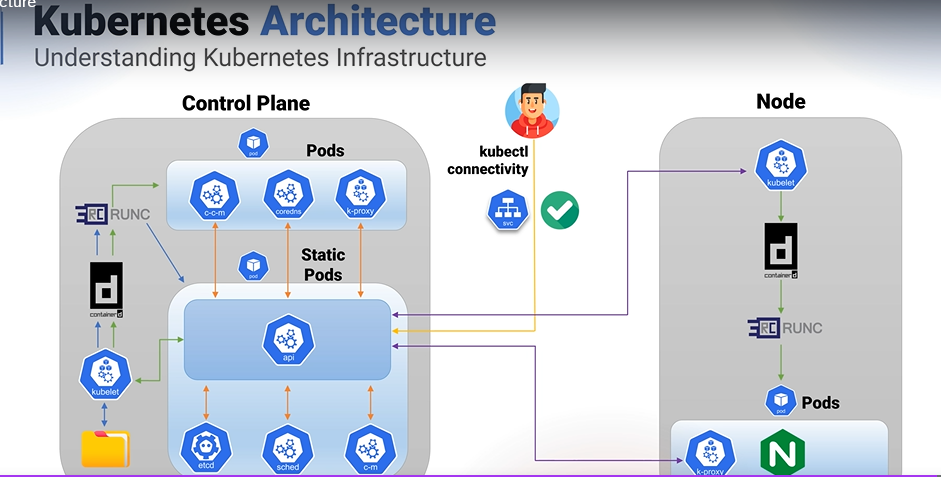

## Hierarchy

The hierarchy in Kubernetes is as follows:
-	A cluster is a collection of nodes that run containerized applications.
-	Each cluster can contain one or more namespaces, which provide a way to group and isolate resources within a cluster.
-	Each namespace can contain multiple Kubernetes objects, such as pods, deployments, services, config maps, and secrets.
-	A pod is the smallest deployable unit in Kubernetes and represents a single instance of a running process in a cluster. A pod can contain one or more containers that share the same network and storage resources. Each container in a pod runs in its own isolated environment, similar to a lightweight virtual machine.
- A pod is usually contained within another Kubernetes object e.g. deployments, services, etc. To permanently delete a pod belonging to another Kubernetes object, you need to delete that object instead
 
- An ingress controller is a service that will create its own separate namespace from the other pods. 
You use it to load balance pods running in other namespaces (e.g. pods in default namespace for example).
 
 -------------
 
 What does single-node cluster mean? It means that the cluster contains only one node (i.e. one VM), aka the master node, and no worker nodes.
 Usually we have worker nodes (i.e. other VMs) that do the work that the master node orchestrates. The worker nodes will create pod(s) inside themselves to do the work.
 With a single node configuration, this means the master node will create the pods inside itself that do the work that it orchestrates. The master node itself also creates a pod that does the orchestration. This all means that nodes do not "do" the work; rather they spin up pods (i.e. containers) that would do the work(s) assigned to them.

--------------------------------------------------------------------------
## k8s architecture (https://capgemini.udemy.com/course/dive-into-cloud-native-containers-kubernetes-and-the-kcna/learn/lecture/42067684#content)

If you want to make a k8s cluster, you need a tool.

The gold standard tool is called `kubeadm`.
There are many other tools like `k3s` or `minikube`,  these will provision a cluster with reduced capabilities but easier to manage.

When you use `kubeadm`, this diagram is what roughly will be generated when the whole cluster is up and running:

 

Let's follow the arrows, along the way we will explain what each component are.
## What happens when you provision a cluster?
1. The VM where the tool is run will have multiple Linux processes and files that make up a `control plane`. It is a set of components for managing and operations of the whole Kubernetes cluster.
  - The folder icon (on the left side below) will be created under `/edc/kubernetes/manifest/` in the computer where the control plane is provisioned on. It contains the specifications of all these components as a `yaml` file
  - The `kubelet` Linux process is run.
      - It is a process that maintains pods.
      - It creates containers based on the `yaml` files it is fed. In our case here it is the manifest files aforementioned.
  - The `kubelet` will call `containerD` which in turn will call `runc`, which will then create containers inside `static pods`.
      - `containerD` is a high-level container runtime, while `runc` is a low level container runtime.
      - The low level container spawns and runs containers, and interacts with low level Linux components e.g. namespaces and cgroups
      - The high level container runtime operates at a higher level and do higher level things e.g. manages the container's lifecycle, pull container images and stores them.
      - See notes in Docker for more info
      - `static pods` are pods that are required in control plane
  - There are 4 `static pods` created:
      - `etcd`:
          - A consistent, distributed, `key value` store
          - It stores all the `yaml` files that will be given by the users as a `json` manifest (i.e. key value!)
          - This means `etcd` is like the back-end of k8s cluster
          - Ideally, in production, it is recommended to run multiple instances of etcd, with odd number of members (i.e. as a cluster); more information below on this
      - `kubeapi` server:
          - This is the main gateway for access to the cluster by outside users, as well as communication between pods.
          - It provides a RESTful API interface
          - Stores data inside etcd (orange arrows in pic)
          - The `kubelet` can also talk directly with the `kubeapi` server for pod creation purposes (shown in green arrow) for non-static pods. The `kubeapi` server will get the yaml, store it in `etcd`, then `kubelet` goes ahead and create the pods using `containerD` and `runc` (green arrow flow) 
          - Same process is done if a worker node wants to create a pod (purple arrows)
      - `kube scheduler`:
          - Even when user asks API to create a pod (like NGINX pod described above), it won't be created; since where will be the pod be placed? Where is the node with the good location, which one is the node that has enough resources?
          - The `kube scheduler` will be the one to determine this, and also other scheduling tasks
      - `controller manager`:
          - Sometimes the user can also request groups of pods to be created i.e. `Deployment` or `StatefulSet` objects. 
          - These in turn will create `DeploymentControllers`
          - The `controller manager` is the k8s component that will make these changes/request these changes.
          - It also controls the node(s) through an automated `Node Controller`.
          - Thus the controller manager is a manager for controllers, that monitor state of the cluster and changes the controllers to drive the state to a particular state.
          - It works in tandem with the `kube scheduler`
  - On top of the 4 static pods, there are also some normal pods that are auto created:
      - `kube proxy`:
        - Now if the user wants to talk to the pod, it would create a `Service` yaml file.
        - The `kube proxy` is a pod that will bridge the communication between inside and outside of cluster, it will act based on the configuration set in this `Service` yaml file.
        - It runs as a DaemonSet (i.e. it runs on every node in the cluster) and is a normal pod
      - `CoreDNS`:
        - This is a DNS server that gives ability for pods to communicate to each other by a FQN (fully qualified name) or even perhaps the pod name
  - When you deploy k8s in the cloud, you can also get a `cloud controller manager`
      - This controller bridges functionality of the cloud provider to the k8s cluster
      - e.g. Integrate load balancer of the k8s cluster with that of the one offerred by the cloud provider
      - See more in `LoadBalancing` section below
  - To have a more robust k8s cluster, we need to run the `control plane` in multiple instances as shown:
   
      - And here as you can see, we run `etcd` as a cluster (i.e. there are multiple instances of it, and each communicate through the Raft Consensus; this is like RabbitMQ)
      - Notice we also have an `API Loadbalancer` now.
        - This is needed because we run the control plane on multiple instances, to manage communication communication between users to the control planes, or between the nodes to the control planes, in a better way.

 ## Why we need deployment/replicationcontroller/statefulset/etc to manage pods?

 When you create unmanaged pods, a cluster node is selected to run the pod and then its containers are run on that node. Kubernetes then monitors those containers and automatically restarts them if they fail. But if the whole node fails, the pods on the node are lost and will not be replaced with new ones, unless those pods are managed by a Deployment, ReplicationControllers or similar.

 Kubernetes keeps your containers running by restarting them if they crash or if their liveness probes fail. This job is performed by the Kubelet on the node hosting the pod—the Kubernetes Control Plane components running on the master(s) have no part in this process.

 But if the node itself crashes, it’s the Control Plane that must create replacements for all the pods that went down with the node. It doesn’t do that for pods that you create directly. Those pods aren’t managed by anything except by the Kubelet, but because the Kubelet runs on the node itself, it can’t do anything if the node fails.

----------------------