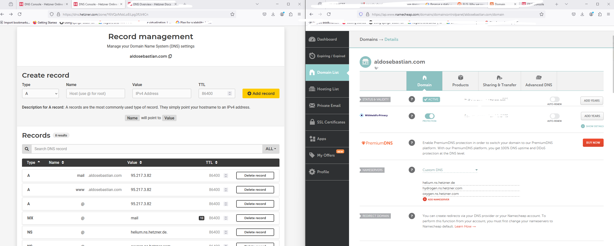

# Website beheren

## NGINX
- Als je een domain op `namecheap.com` heeft gekocht, volg de instruties op https://www.youtube.com/watch?v=zOPH54ltGLQ
om je droplet te configureren met de domain naam.
- En dan, volg de instruties op https://www.digitalocean.com/community/tutorials/how-to-install-nginx-on-ubuntu-20-04 om
je server met NGINX en ufw te configureren, zodat je je server met je domain naam toegang kan krijgen.
- NGINX is een toepassing die internetverbindingen met je server configureren.
- Belangrijke mappen in NGINX, en korte omschrijving erover:
```
/
├── var/
│   ├── www/
│   │   ├── html (Dit bestand omvat je html bestanden)/
│   │   │   └── index.nginx-debian.html
│   │   └── aldosebastian/
│   │       └── html/
│   │           └── index.html
│   └── log/
│       └── nginx/
│           ├── access.log (elke vraag naar je web server wordt in dit bestand opgetekend)
│           └── error.log (elke errors wordt hier opgetekend)
└── etc/
 └── nginx/
     ├── sites-available (die map omvat de zogenaamde `server-blocks`)/
     │   ├── default
     │   └── aldosebastian
     ├── sites-enabled (die map omvat `linux symlinks` die naar bestanden in sites-available bestand verwijzen)/
     │   ├── default
     │   └── aldosebastian
     ├── nginx.conf (het hoofdconfiguratiebestand voor nginx)
     ├── (andere mappen)
     └── ...
```
- Elk bestand in `sites-available` omvat een inhoud vergelijkbaar met het volgende:
```
server {
        listen 80;
        listen [::]:80;

        root /var/www/your_domain/html;
        index index.html index.htm index.nginx-debian.html;

        server_name your_domain.com www.your_domain.com;

        location / {
                try_files $uri $uri/ =404;
        }
}
```
Met deze inhoud, als je naar `www.your_domain.com:80` gaat, zul je de `index.html` pagina 
die in `/var/www/your_domain/html` map zien.
- Meer over NGINX `server-blocks` configuratie: https://www.digitalocean.com/community/tutorials/understanding-nginx-server-and-location-block-selection-algorithms
- Commandos (ze zijn vanzelfsprekend):
  - sudo systemctl start nginx
  - sudo systemctl restart nginx
  - sudo systemctl reload nginx (herstarten zonder huidige verbindingen laten vallen)
  - sudo systemctl disable nginx (zet auto-start van nginx als de server herstarten uit)
  - sudo systemctl enable nginx (zet auto-start van nginx als de server herstarten aan)
  - sudo nginx -t (controleren of je fouten in je Nginx bestanden maakt)
  
## UFW
- Dit is een firewall toepassing, die verbindingen naar bepaalde poorten blokkeert/toestaan.
- In de achtergrond, werkt deze toepassing een andere toepassing heette `iptables` bij.
  - Een Docker container werkt de `iptables` toepassing direct bij, dus poorten die `ufw` als geblokkeert aangemeld is
    misschien niet echt geblokkeerd! Meer informatie: https://askubuntu.com/questions/652556/uncomplicated-firewall-ufw-is-not-blocking-anything-when-using-docker
- Soms na configuratie van deze toepassing, kunt je geen meer SSH verbinding maken. Meer info hier https://superuser.com/questions/1508570/can-not-access-ubuntu-server-with-ssh-after-allowing-firewall.

    
***In kortom, vergeet niet om `ufw allow ssh` uit te voeren!!! Anders moet je met een fysieke keyboard en monitor
naar je server aansluiten, en ssh werkt niet meer!***

- Commandos (ze zijn vanzelfsprekend):
  - sudo ufw app list
  - sudo ufw status
  - sudo ufw allow 'een-van-de-uitvoer-van-sudo-ufw-app-list'
  
## SSL
- Uitgebreid: https://www.digitalocean.com/community/tutorials/how-to-secure-nginx-with-let-s-encrypt-on-ubuntu-20-04
- Momenteel in Smallblog is SSL geinstalleerd. De configuratie is zodat alle HTTP verbindingen, onafhankelijk van de poort,
aan HTTPS aangepast worden.

## What happens when you type in a domain name to url bar (how DNS works)
Your router resolves the domain name you type in using a Domain Name System (DNS) resolver. There are various DNS resolvers that it will ask, returning the first one with an answer.

When your router DNS resolver receives a query (for example, a request to resolve a domain name to an IP address), it checks its local cache. If the information is not present in the cache or has expired, the resolver starts A DNS recursion process.

Root DNS Servers: The resolver first contacts a root DNS server (there are 13 of them in the world https://www.iana.org/domains/root/servers). These servers are the starting point for resolving domain names. The root servers don't contain the specific information about domain names but instead will help direct the resolver to the TLD servers responsible for top-level domains (like .com, .org, .net, etc.). For our website it would direct the resolver to the TLD server for .com.

- Example: if I type in example.com, the router will ask each of the 13 servers hey what is the IP of the TLD server owning .com (let's say 2.2.2.2)

Top-Level Domain (TLD) Servers: As in the example above, the root DNS servers direct the resolver to the appropriate TLD servers based on the domain's extension (.com, .org, .net, etc.). For instance, if the domain is "example.com," the resolver contacts the .com TLD server (i.e. 2.2.2.2)

Authoritative DNS Servers: The TLD servers then guide the resolver to the authoritative DNS servers responsible for the specific domain, in this case, "example.com." These authoritative servers contain the actual DNS records for the domain, such as IP addresses associated with the domain's hostname.

- Example: The 2.2.2.2 TLD server will then look up which Authoritative DNS servers own `example.com`. Let's say it found Hetzner, which have `hydrogen.ns.hetzner.com., oxygen.ns.hetzner.com. and helium.ns.hetzner.de. `. 

So, how do we then register a domain to a nameserver(s) e.g. register `example.com` to the Hetzner nameservers above? 
After we buy let's say the example.com domain from `namecheap`, we need to also find a nameserver provider that will "own" this domain, let's say `Hetzner`. So we go to Hetzner.com, and find its DNS provider service. We then can make an account and register our domain there. In `namecheap`, we also then need to specify that this domain we bought is owned by `Hetzner` nameservers.



There are many DNS server providers e.g. Cloudflare `https://developers.cloudflare.com/dns/nameservers/` or Google `https://cloud.google.com/dns/docs/tutorials/create-domain-tutorial`
DNS Record Retrieval: The resolver sends a query directly to the authoritative DNS servers, asking for the specific DNS record it needs (like an A record for the IP address). The authoritative servers respond with the requested information.

Response Back to Resolver: The authoritative DNS servers send the resolved information (such as the IP address associated with the domain) back to the initial resolver that made the query.

Caching: The resolver caches the received information locally for future use, reducing the need to repeat the entire process if someone else requests the same domain name in the near future.

This recursive process allows DNS resolvers to efficiently find the IP address associated with a domain name by querying various DNS servers in a hierarchical manner, starting from the root servers down to the authoritative servers responsible for the specific domain.

# SSL, CA, HTTPS how do they work
- Your browser by default contains a list of wh